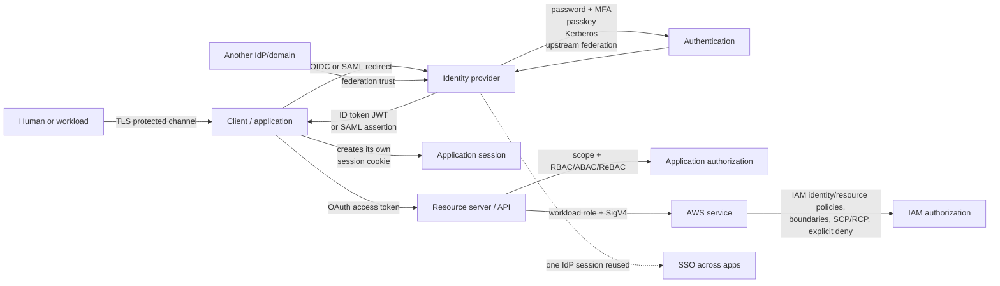

# 00 · Start here: the identity and security map

> **TL;DR** — These words are not competitors at one level. **TLS** protects the connection.
>**Authentication** proves an identity, using a password/passkey/MFA/Kerberos/etc. **Federation**
>says another security domain may vouch for that identity. **SSO** is the experience of reusing one
>login across apps. **SAML** and **OIDC** carry federated login; OIDC uses OAuth machinery and an ID
>token. **OAuth** delegates limited API authority and emits an access token. **JWT** is only one
>signed token format. **Authorization** decides what the verified principal may do, through scopes,
>roles, relationships, IAM policies, or application rules. **IAM Identity Center** is AWS workforce
>SSO; **IAM** authorizes AWS API principals; **Cognito User Pools** authenticate application users;
>**Cognito Identity Pools** trade external proof for temporary AWS credentials.

## The one diagram



Read it from bottom up when debugging:

1. Was the channel really TLS with certificate verification?
2. Who authenticated what, with which factor?
3. Who issued the proof, and why does the receiver trust that issuer?
4. Is the object an ID token, access token, refresh token, session ID, SAML assertion, Kerberos
   ticket, or AWS temporary credential?
5. Is it intended for this audience, unexpired, unmodified and bound to this transaction/client?
6. Which policy decides this action on this resource?

## The layers: stop comparing unlike things

| Layer / question | Concepts | Output |
| --- | --- | --- |
| Transport: “can the network read/change/impersonate?” | TLS (historically called SSL), certificate chains, mTLS | encrypted/authenticated channel |
| Primary authentication: “how was identity proven?” | password, TOTP/MFA, passkey/WebAuthn, smart card, Kerberos pre-auth | authenticated principal/session at verifier |
| Identity provider: “who performs login and signs results?” | Cognito User Pool, Entra ID, Okta, Google, IAM Identity Center, corporate Federate | IdP/OP session + assertion/token |
| Federation: “may another domain vouch?” | direct trust, broker, SAML, OIDC, IAM SAML/OIDC provider | external identity mapped/re-issued locally |
| SSO: “how many prompts?” | reusable IdP session, Kerberos TGT | several app sessions after one login |
| Protocol: “which messages/rules?” | Kerberos, SAML 2.0, OAuth 2.0, OpenID Connect, WebAuthn | requests, responses and validation contract |
| Credential/token representation | opaque session/token, JWT/JWS/JWE, SAML XML, Kerberos ticket, AWS key triple | bytes the holder presents |
| Delegation: “what may this client do for someone?” | OAuth scopes/access token, STS role session | bounded temporary authority |
| Authorization: “may this principal do this action here?” | RBAC, ABAC, ReBAC, ACL, IAM/Cedar policy | Allow/Deny (often 403 vs 404) |
| Lifecycle: “who exists and what happens when they leave?” | directory, SCIM, joiner/mover/leaver, revocation | provision/update/disable records and sessions |

A technology can occupy several layers. Cognito User Pools are directory + authentication +
OAuth/OIDC issuer. Identity Center is workforce directory/federation/SSO + permission-set
provisioning. That does not erase the layer boundaries; it packages them.

## The five confusions to settle first

### 1. SSO is not federation

- **SSO**: Alice authenticates once and App A then App B do not prompt again. It is session reuse.
- **Federation**: App trusts identity vouched for by another security domain. It is configured
  trust.

Examples:

| Situation | SSO? | Federated? |
| --- | ---: | ---: |
| one company IdP silently signs Alice into two internal apps | yes | possibly no (one domain) |
| “Sign in with Google” prompts Google every visit to one app | no | yes |
| partner employee already logged into partner IdP enters your SaaS silently | yes | yes |
| two apps share one parent-domain session cookie | yes | no |

Federation often enables SSO, so product pages blur the words. Chapter 07 demonstrates the
separate IdP/App-A/App-B sessions and a federation broker.

### 2. OAuth is not login

OAuth answers: **may client C call resource server R with scope S on behalf of owner O?**

OIDC adds: **who authenticated at issuer I for relying party/client C in this transaction?**

| Object | Intended consumer | Meaning |
| --- | --- | --- |
| OAuth access token | API/resource server | delegated authority/scopes |
| OIDC ID token | client/relying party | signed authentication result |
| refresh token | authorization server | permission to mint replacements |

Using a random OAuth access token as proof of login was the pre-OIDC interoperability/security
problem. Chapter 05 runs pure OAuth with no ID token; chapter 06 adds `scope=openid`, nonce and an
ID token.

### 3. Token is not JWT

Token is the category: bytes whose possession/reference represents something. JWT is one compact,
normally signed, JSON format.

| Token | Opaque or self-contained? | Typical verification |
| --- | --- | --- |
| server session ID | opaque | session-store lookup |
| OAuth reference access token | opaque | introspection/store lookup |
| JWT access or ID token | self-contained | public-key signature + claims |
| SAML assertion | self-contained signed XML | XML signature + audience/time/recipient |
| Kerberos ticket | encrypted/authenticated structure | service's shared key + time/authenticator |
| refresh token | usually opaque | authorization-server lookup/rotation state |
| AWS temporary credentials | access-key ID + secret + session token | SigV4 signature + STS session context |

JWT is readable by default. Signing proves issuer/integrity; it does not hide claims. Chapter 03
attacks a naive verifier and compares reference tokens.

### 4. Authentication is not authorization

- Authentication: “this request is Alice” (or `client:inventory-job`). Failure usually 401.
- Authorization: “Alice may edit document 42 right now.” Valid identity but denied usually 403,
  sometimes 404 to hide object existence.

A group/role can feed authorization, but being signed in is never “allow everything.” Chapter 12
runs RBAC, ABAC and ReBAC over the same document request.

### 5. SAML and OIDC are alternatives; OAuth is inside one of them

SAML 2.0 and OIDC both carry federated browser authentication. SAML uses signed XML and its own
bindings. OIDC is an identity layer on OAuth 2.0 and uses an ID token, normally JWT.

| | SAML 2.0 | OIDC |
| --- | --- | --- |
| Era / shape | enterprise web, 2005, XML | web/mobile/API era, 2014, JSON/JWT |
| Identity statement | SAML Assertion | ID token |
| Application | Service Provider (SP) | Relying Party (RP) / OAuth client |
| Identity issuer | Identity Provider (IdP) | OpenID Provider (OP) |
| Return endpoint | Assertion Consumer Service (ACS) | registered redirect URI |
| API token | none built in | OAuth access token alongside login |
| Configuration | SAML metadata + certificate | discovery + JWKS |
| New build default | only when counterparty requires it | usually yes |

## One real story, every layer

Alice opens `orders.example`:

1. Browser connects with **TLS**. The certificate chain/name proves it reached `orders.example`;
   encryption protects every cookie/code/token below.
2. Orders has no local session, so it redirects to the company **IdP**.
3. The IdP sees no session. Alice authenticates with a **passkey** (or password + MFA, or her
   managed workstation's **Kerberos** context).
4. If the company IdP is upstream of an app broker, this is **federation**: broker verifies the
   upstream result and issues a local one.
5. Orders uses **OIDC Authorization Code + PKCE**. Browser carries a one-use code; backend exchanges
   it. (`SAML` would instead POST a signed XML response.)
6. Client verifies ID-token signature, `iss`, `aud`, `exp`, `nonce`, then creates its own opaque,
   HttpOnly **session cookie**.
7. Because the IdP retains its own cookie, Reports can repeat the redirect and get a result without
   another prompt: **SSO**. Reports still has a separate local session.
8. Orders calls Orders API with an **OAuth access token**, not the ID token. API verifies audience,
   type, expiry and `orders:read` scope.
9. API asks application **authorization**: does Alice own order 42 / have a mapped role or
   relationship? Scope alone is too coarse.
10. API Lambda accesses DynamoDB using its **IAM execution role** and temporary credentials;
    SigV4 authenticates that workload and IAM policy authorizes the AWS request.

Every step can be correct while a later one fails. “The JWT validates” cannot explain a missing
scope; “SSO works” cannot prove deprovisioning; “HTTPS padlock” cannot identify Alice.

## AWS names mapped to the layers

| AWS concept | For whom | Main job | Output / downstream |
| --- | --- | --- | --- |
| IAM | AWS principals/workloads/federated sessions | authorize AWS API actions/resources | Allow/Deny per SigV4 request |
| STS | principals exchanging trusted proof/role permission | temporary AWS sessions | access key ID + secret + session token + expiry |
| IAM role | workload/federated identity/session | trust gate + permission set | assumed-role session |
| IAM Identity Center | workforce | multi-account/app SSO, assignments, permission sets | target-account IAM role sessions |
| Cognito User Pool | application customers/users | directory, authentication, OAuth/OIDC issuer | ID/access JWT + refresh token |
| Cognito Identity Pool | federated app identities/guests | broker to temporary AWS credentials | identity ID + role credentials |
| API Gateway JWT authorizer | API callers | verify access JWT/claims/scopes before integration | verified claims or 401/403 |
| AWS Directory Service / Managed AD | workforce/domain machines/services | Active Directory/Kerberos/LDAP domain | Kerberos tickets, directory identity |
| ACM / Private CA | servers/workloads | TLS certificate lifecycle/trust | X.509 certificate/key integration |
| Amazon Verified Permissions | application principals/resources | Cedar policy decision point | application Allow/Deny |

**IAM vs Identity Center:** IAM is the AWS authorization substrate. Identity Center is the
workforce SSO/assignment experience that provisions/uses IAM roles across accounts.

**User Pool vs Identity Pool:** User Pool signs application-user JWTs. Identity Pool accepts
configured identity proof and vends temporary AWS role credentials. Most API apps need only a
User Pool; direct S3/AWS access from an untrusted client may justify both (chapter 11).

**Customer vs workforce:** Cognito is customer/app identity. Identity Center is employee/workforce
access. Do not build employee AWS access from Cognito or customer sign-up from IAM users.

**Federate:** at Amazon, Federate is a concrete corporate federation service/touchpoint. “Federated”
is the generic relationship. Treat product details as organisation-specific; the protocol map
above remains the useful mental model.

## Which chapter should I read?

| If your question is… | Read / run |
| --- | --- |
| Why hash passwords? Why cookies/CSRF/session rotation? | [01 Passwords and sessions](../01-passwords-and-sessions/) |
| What does HTTPS actually prove? What is SSL/mTLS/certificate trust? | [02 TLS](../02-tls/) |
| Token vs JWT? Why `iss/aud/exp/kid`? Why not localStorage? | [03 Tokens and JWT](../03-tokens-and-jwt/) |
| Why does Windows/domain SSO use tickets/KDC/time? | [04 Kerberos](../04-kerberos/) |
| What does OAuth authorize? Why code/PKCE/state/refresh/client credentials? | [05 OAuth 2.0](../05-oauth2/) |
| What does OIDC add? ID vs access token, nonce/discovery/JWKS? | [06 OIDC](../06-oidc/) |
| SSO vs federation? Broker, linking, SCIM, logout? | [07 SSO and federation](../07-sso-and-federation/) |
| How does enterprise SAML XML/signature/Audience/InResponseTo work? | [08 SAML](../08-saml/) |
| TOTP math and attacks? Why passkeys resist phishing? | [09 MFA/TOTP/passkeys](../09-mfa-totp-passkeys/) |
| IAM vs Identity Center? Roles/STS/policy evaluation/GitHub OIDC? | [10 AWS IAM and federation](../10-aws-iam-and-federation/) |
| Cognito User Pool vs Identity Pool? JWT vs temporary AWS credentials? | [11 Cognito pools](../11-cognito-pools/) |
| Scope vs role vs permission? RBAC/ABAC/ReBAC? | [12 Authorization](../12-authorization/) |
| How do I threat-model a whole design and pick controls? | [13 Threat model and decision guide](../13-threat-model/) |

## Decision guides

### Login for humans

```text
Are these employees accessing AWS accounts/SaaS?
  yes → IAM Identity Center / workforce IdP; permission sets/roles; SAML/SCIM or directory
  no  → application customers?
          yes → managed customer IdP/User Pool using OIDC Code + PKCE
          no  → one small first-party web app?
                  server session may be simpler than JWT/federation

Authentication factor:
  phishing resistance required → passkeys/WebAuthn or security keys
  transitional baseline        → password + TOTP (rate-limit, replay prevention, recovery)
  managed domain/intranet      → Kerberos may provide workstation SSO; web edge may bridge to OIDC/SAML
```

### Tokens and sessions

```text
One web backend, instant logout required?       → opaque server-side session cookie
Many APIs verify one issuer independently?      → short access JWT + JWKS
Immediate central revocation/privacy required?  → opaque access token + introspection
Browser-based OAuth?                            → BFF + HttpOnly session preferred; Code + PKCE
Machine on AWS?                                 → workload IAM role, not OAuth client secret if avoidable
Bearer theft unacceptable?                      → sender-constrain with mTLS/DPoP (plus normal controls)
```

### Authorization

```text
Few stable job functions?                         → RBAC
Rules depend on user/resource/environment tags?   → ABAC
Sharing/ownership/groups/folder inheritance?       → ReBAC
AWS API request?                                  → IAM policies and service-specific controls
Complex application policy?                       → in-service code or Cedar/Verified Permissions/OPA/OpenFGA
Always: coarse scope at edge + resource decision in service/data layer.
```

## Glossary

| Term | Compact meaning |
| --- | --- |
| Authentication (AuthN) | establish which principal controls this request/session |
| Authorization (AuthZ) | decide whether that principal may perform one action on one resource/context |
| Principal | actor named by the security system: user, role session, service account, workload |
| Identity | stable representation of a principal; namespaces matter (`iss + sub`) |
| Credential | secret/proof used to authenticate: password, private key, session token, bearer token |
| Factor | independent authentication category: know (password), have (device/key), are (biometric) |
| MFA | authentication requiring factors from at least two categories |
| Passkey / WebAuthn | origin-bound public-key credential unlocked locally by device/PIN/biometric |
| IdP | Identity Provider; authenticates and issues signed identity assertions |
| OP | OpenID Provider, OIDC's IdP term |
| RP | Relying Party; app that verifies an OIDC result |
| SP | Service Provider; app that consumes SAML |
| AS | OAuth Authorization Server; issues access/refresh tokens after grants |
| RS | OAuth Resource Server; API that accepts access tokens |
| Directory | users/groups/lifecycle data; may be separate from IdP |
| Federation | configured trust in identity vouched for by another security domain |
| Broker | verifies upstream providers, maps identity/claims, issues local proof |
| SSO | one authentication interaction reused to enter multiple applications |
| SLO | coordinated logout across IdP/RPs; distributed and never as atomic as the name suggests |
| JIT provisioning | create/update local account when federated login occurs |
| SCIM | HTTP/JSON protocol for provisioning/deprovisioning users/groups; not login |
| OAuth 2.0 | delegated authorization framework for client access to resource servers |
| OIDC | authentication/identity layer on OAuth 2.0 (`openid`, ID token, UserInfo, discovery) |
| SAML | XML-based federation/assertion protocol, common in enterprise browser SSO |
| Kerberos | symmetric KDC/ticket protocol for managed-domain SSO and mutual authentication |
| TLS | channel confidentiality, integrity, server auth; optionally client auth (mTLS) |
| SSL | obsolete predecessor/name people still use for TLS; do not enable SSL protocols |
| Certificate | signed binding between public key and names/usage/time window |
| CA / trust store | authority that signs certificates / roots a verifier chooses to trust |
| Token | credential/reference carrying authority or identity; not necessarily JWT |
| Bearer token | whoever possesses bytes can use them; no holder-key proof |
| Opaque/reference token | random handle whose meaning is looked up at issuer/store |
| JWT | JSON claims in compact JWS/JWE; usually signed JWS, readable unless encrypted |
| JWS / JWE | JSON Web Signature / Encryption |
| JWK / JWKS | JSON Web Key / set of keys; public JWKS supports signature verification/rotation |
| `kid` | key identifier/index; not a trust decision by itself |
| `iss` / `sub` / `aud` | issuer / subject / intended audience |
| `exp` / `nbf` / `iat` | expires / not valid before / issued at (Unix NumericDate seconds) |
| ID token | OIDC authentication result intended for one client/RP |
| Access token | OAuth delegated authority intended for resource server/API |
| Refresh token | credential used only at AS to obtain replacement tokens |
| Authorization code | short one-use browser-carried handle exchanged at token endpoint |
| PKCE | binds code redemption to client instance using verifier + SHA-256 challenge |
| `state` | binds OAuth callback to browser/client transaction; CSRF/mix-up defense |
| `nonce` | binds OIDC ID token to one authentication request |
| Scope | delegated capability granted to a client; not equivalent to a user's role |
| Session | server/client state remembering prior authentication; app and IdP sessions differ |
| Cookie | browser state transport; `HttpOnly`, `Secure`, `SameSite`, scope and expiry matter |
| CSRF | cross-site request causes browser to send ambient cookies without user's intent |
| XSS | attacker executes script in trusted origin; can issue requests/read non-HttpOnly data |
| RBAC / ABAC / ReBAC | role-, attribute-, and relationship-based authorization models |
| PEP / PDP | Policy Enforcement Point / Decision Point |
| IAM | AWS principal, role, trust and policy authorization system |
| STS | AWS temporary role/session credential service |
| SigV4 | AWS request-signature protocol using access/secret/session credentials |
| SCP / RCP | Organizations principal-side / resource-side maximum guardrails; do not grant |
| Permissions boundary | maximum identity permission for IAM user/role; does not grant |
| Permission set | Identity Center template provisioned as roles in assigned AWS accounts |
| User Pool | Cognito customer directory/authentication/OAuth-OIDC token issuer |
| Identity Pool | Cognito broker from external/app identity to temporary AWS credentials |
| IRSA | EKS service-account OIDC token → STS role path |
| EKS Pod Identity | newer EKS-managed pod-to-role path using agent/service, not an app IdP |
| mTLS | both TLS peers present/prove certificate keys |
| DPoP | application-layer key proof that sender-constrains an OAuth token |
| Replay | reuse a captured valid credential/message; time, nonce/state, one-use records help |
| Confused deputy | privileged service is tricked into exercising authority for wrong requester/tenant |
| Least privilege | grant only required action/resource/context for required duration |
| Zero trust | continuously make explicit identity/device/context decisions; not a product or “trust nobody” |

## A final mental model

Security is a chain of statements:

```text
TLS:       I reached the intended endpoint through an intact private channel.
AuthN:     This principal proved a credential/factor.
Federation:This configured issuer may vouch for that external subject.
SSO:       The issuer reused its prior authentication session, so no new prompt.
Token:     These bytes carry/reference a signed/scoped/time-bounded statement.
OAuth:     This client received delegated authority toward this resource server.
AuthZ:     This principal/client may perform this action on this resource now.
IAM:       This AWS role session may make this AWS API request under all policy layers.
Lifecycle: This identity and its grants are still supposed to exist.
```

Never let one true line stand in for the next one.
