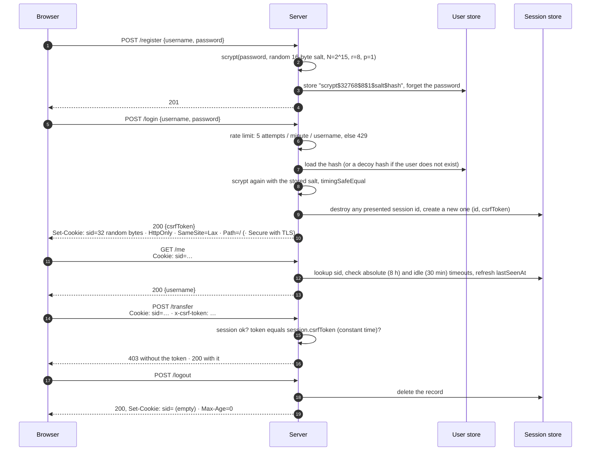

# 01 · Passwords and sessions

> **TL;DR** — The baseline everything else in this lab is compared against. The
> user proves who they are with a password; the server remembers that proof in a
> session so the password is not sent again. Store passwords as a slow, salted,
> memory-hard hash (scrypt, bcrypt, Argon2), never sha256, never plaintext. Keep
> sessions server-side behind an opaque random id in an `HttpOnly; Secure; SameSite`
> cookie, with idle and absolute timeouts, a new id at login, real deletion at logout.
> Right for one app that owns its users. Wrong when many services must trust one login
> (chapter 03) or when a managed IdP or federation (chapter 07) can do it for you.

## Why it was invented

**Passwords.** MIT's CTSS (1961) was one of the first time-shared computers
and the first to ask for a password, because several people shared one machine
and the files on it. By 1962 a researcher had already printed the password file to get
more computer time. Early Unix stored passwords in the clear in `/etc/passwd`
too, and the file was world-readable. Morris and Thompson's 1979 paper
*Password Security: A Case History* describes the fix that is still the shape
of the solution today: do not store the password, store a one-way function of
it; add a random *salt* so identical passwords look different; make the
function *slow* (their `crypt(3)` ran DES 25 times, a work factor tuned to the
hardware of 1979).

Then the web forgot. Fast general-purpose hashes (MD5, SHA-1) were used bare,
and breach dumps showed what that means:

| Year | Breach | Storage | Result |
| --- | --- | --- | --- |
| 2009 | RockYou | plaintext | 32 million passwords published; still the seed of every cracking wordlist |
| 2012 | LinkedIn | unsalted SHA-1 | 6.5 million hashes posted, most cracked in days; the full 117 million dump surfaced in 2016 |
| 2013 | Adobe | 3DES-encrypted (not hashed), with plaintext hints | one key for everyone; identical passwords had identical ciphertext, hints did the rest |
| 2013 | Yahoo | mostly MD5 | 3 billion accounts |

Two things make fast hashes useless for passwords. First, speed: a single
consumer GPU computes on the order of 10^11 MD5 hashes per second, and most
human passwords fall to a few billion guesses. Second, no salt: the same
password always gives the same hash, so one precomputed table (Oechslin's
*rainbow tables*, 2003) cracks every user of every site. The answer was a line
of purpose-built *password hashing functions*, each adding a knob the attacker
cannot turn:

| Year | Function | What it added |
| --- | --- | --- |
| 1979 | `crypt(3)` (Morris, Thompson) | salt, deliberate slowness |
| 1994 | md5-crypt (FreeBSD) | 1000 rounds of MD5; tunable cost was the idea, MD5 the mistake |
| 1999 | bcrypt (Provos, Mazières) | a *cost* parameter you raise as hardware improves; based on Blowfish's slow key setup |
| 2000 | PBKDF2 (PKCS #5 v2.0, RFC 2898, now RFC 8018) | iterate an HMAC; standard, FIPS-approved, but cheap on GPUs |
| 2009 | scrypt (Percival, RFC 7914) | *memory-hard*: each hash needs tens of MiB of RAM, which GPUs and ASICs do not have per core |
| 2015 | Argon2 (Biryukov, Dinu, Khovratovich, RFC 9106) | winner of the Password Hashing Competition; separate knobs for memory, time and parallelism, and a side-channel-resistant mode (Argon2id) |

**Sessions.** HTTP is stateless: every request stands alone. Sending the
password on every request (HTTP Basic auth) means the secret crosses the wire
constantly and the browser has to keep it in memory. Netscape's Lou Montulli
invented the cookie in 1994 (standardised as RFC 2109 in 1997, today RFC 6265)
so a server could hand the browser a small value and get it back on the next
request. Put a random id in that cookie, keep the record on the server, and you
have a session: log in once, be remembered for a while, be forgotten on demand.
The cookie's defensive attributes came later, each after a class of attack:
`Secure` (with the cookie itself), `HttpOnly` (Internet Explorer 6 SP1, 2002,
against cookie theft through XSS), `SameSite` (2016, Chrome default `Lax` in
2020, against CSRF), and the `__Host-`/`__Secure-` prefixes (2016, against
cookie injection from sibling hosts).

## How it works

Two mechanisms, one story:



### Storing a password

`src/passwords.ts`. The server never keeps the password. At registration it
draws 16 random bytes of salt, runs scrypt, and stores one self-describing
string:

```
scrypt $ 32768 $ 8 $ 1 $ zGbN+Szn60p5SsQpx2DSXw== $ vAqwGGFC95Rg6Qy3B1Sbg…
  │       │      │   │   └─ salt, base64, public       └─ 64-byte derived key
  │       │      │   └─ p, parallelism
  │       │      └─ r, block size (128·r bytes per block)
  │       └─ N, CPU/memory cost: 128·N·r = 32 MiB of RAM per hash
  └─ algorithm, so a future you can migrate to something else
```

At login the server parses the string, runs scrypt with the *same* salt and
parameters, and compares the result with `crypto.timingSafeEqual`. Because the
parameters travel with the hash, you can raise `N` next year and re-hash each
user at their next successful login (`needsRehash()`); nobody has to reset
anything.

Why a slow, memory-hard hash instead of sha256, in numbers from the demo on a
laptop:

| | sha256 | scrypt N=2^15, r=8 |
| --- | --- | --- |
| one hash | ~0.0006 ms | ~45 ms |
| memory per hash | bytes | 32 MiB |
| your user, once per login | free | unnoticeable |
| attacker, per guess, per user | free | 45 ms **and** 32 MiB, so no thousand-way GPU parallelism |

**How to pick a work factor.** Measure on the hardware that will run logins.
Aim for something the user does not notice (50–250 ms) and revisit it every
couple of years. Current baseline recommendations (OWASP Password Storage
Cheat Sheet, 2024):

| Function | Minimum today | Knob to raise later |
| --- | --- | --- |
| Argon2id | m = 19 MiB, t = 2, p = 1 (OWASP floor); RFC 9106 suggests m = 64 MiB, t = 3, p = 4 | memory first |
| scrypt | N = 2^17, r = 8, p = 1 (128 MiB), or N = 2^15 with p = 3 | N |
| bcrypt | cost 10 | cost (each +1 doubles the time); note the 72-byte input limit |
| PBKDF2-HMAC-SHA256 | 600 000 iterations | iterations; pick it only where FIPS compliance forces you |

This chapter uses N = 2^15, p = 1 (32 MiB, ~45 ms) so the tests stay quick.
In production, with the memory to spare, go to N = 2^17 or use Argon2id.
Node's `crypto.scrypt` refuses to run above `maxmem` (default 32 MiB), which is
why the code passes it explicitly: a typo like N = 2^25 should fail loudly, not
take the server down.

**Salt vs pepper.**

| | Salt | Pepper |
| --- | --- | --- |
| What | 16 random bytes per user | one secret key for the whole system |
| Where | next to the hash, in the database | *not* in the database: AWS Secrets Manager, KMS, an HSM, an env var the database host never sees |
| Defends against | rainbow tables, spotting users with the same password, cracking all users at once | a database dump on its own: without the pepper the hashes cannot even be attacked |
| How | input to the hash | `HMAC(pepper, password)` before the slow hash, or encrypt the stored hash with it |
| Cost | none | key management: rotating a pepper means re-hashing everyone at their next login (keep the key id in the stored string), and losing it means everyone resets their password |

NIST SP 800-63B requires the salt and recommends the pepper: a second, keyed
step with a secret known only to the verifier and stored apart from the hashes.
This chapter implements the salt; the pepper is a one-line addition once you
have a secret store.

**Password policy.** NIST SP 800-63B (Revision 3 in 2017, Revision 4 in 2025)
reversed a generation of folklore. The rules that matter:

| Do | Don't |
| --- | --- |
| require at least 15 characters when a password is the only factor (Revision 4); systems that always require MFA may accept 8, but longer is still better | require character classes ("one uppercase, one digit, one symbol"): they produce `Password1!` |
| allow at least 64 characters, spaces and all of Unicode | truncate silently (bcrypt stops at 72 bytes) |
| check against a denylist of breached and common passwords (Have I Been Pwned's Pwned Passwords, k-anonymity API) | force periodic rotation; change only on evidence of compromise |
| rate limit attempts and add MFA (chapter 09) | use security questions |
| allow paste and a "show password" toggle (they help password managers) | store hints |

`checkPasswordPolicy()` in `src/passwords.ts` is the short version of this.

### Recognising the user again: sessions

`src/sessions.ts`. After a good login the server creates a record and gives
the browser an *opaque* id: 32 random bytes as base64url, 43 characters, 256
bits of entropy. Opaque means it carries nothing; it is a key into the server's
Map. That is why revocation is instant (delete the key) and why the client can
learn nothing by looking at it. Each record holds:

| Field | Purpose |
| --- | --- |
| `id` | the cookie value |
| `userId` | who this is; the only place the identity comes from |
| `csrfToken` | a second random secret, returned to the page in JSON, never in a cookie |
| `createdAt` | for the absolute timeout |
| `lastSeenAt` | for the idle timeout, refreshed on every valid request |

Two timeouts, both enforced by the server, because the client controls its own
clock and cookie jar:

| Timeout | Here | Protects against |
| --- | --- | --- |
| Idle | 30 min without a request | the unattended laptop, the stolen cookie the thief has not used yet |
| Absolute | 8 h after login, however active | the stolen cookie the thief keeps warm; also forces re-authentication so long-lived access needs a fresh proof |

Three more behaviours, each a defence:

- **Rotate at login.** Whatever id the browser presented is deleted and a new
  one issued. Otherwise an attacker who plants a known id in the victim's
  browser (through a URL, a subdomain, an XSS on a sibling host) waits for the
  victim to log in and then owns the authenticated session: *session fixation*.
- **Delete at logout.** Clearing the cookie only affects that browser. Deleting
  the server record kills every copy of the cookie, including the one exfiltrated
  five minutes ago. Same tool for "log me out everywhere" on password change:
  `destroyAllForUser()`.
- **Sweep.** Abandoned sessions are only noticed when presented. A real store
  expires them for you (Redis `EXPIRE`, DynamoDB TTL); the in-memory Map has a
  `sweep()`.

### The cookie

`src/server.ts` sets `sid=<id>; HttpOnly; SameSite=Lax; Path=/` and adds
`Secure` when `TLS=1`.

| Attribute | Effect | Attack it stops |
| --- | --- | --- |
| `HttpOnly` | `document.cookie` cannot read it | cookie theft through XSS (XSS can still *use* the session while the page is open) |
| `Secure` | never sent over plain `http://` | sniffing on a hostile network, downgrade tricks |
| `SameSite=Strict` | never sent on any cross-site request, not even when the user clicks a link to you | CSRF, at the cost of "I followed a link and I am logged out" |
| `SameSite=Lax` | sent on same-site requests and on top-level GET navigations only; not on cross-site POST, fetch, iframe, image | the classic CSRF form. Chrome's default since 2020 for cookies with no attribute (with a two-minute exception for POST that explicit `Lax` does not get) |
| `SameSite=None` | always sent; requires `Secure` | nothing; it is for embedded third-party widgets |
| `Path=/` | sent for every path on the host | nothing: any page on the origin can reach any path, so `Path` is scoping, not a boundary |
| `Domain=example.com` | shared with every subdomain | nothing; **omit it** so the cookie is host-only and a compromised `blog.example.com` cannot read or overwrite it |
| `__Host-` prefix | browser refuses the cookie unless `Secure`, `Path=/` and no `Domain` | cookie injection from sibling hosts or over http; use it in production |
| no `Max-Age`/`Expires` | a browser "session cookie", dropped when the browser closes | nothing on its own: the server-side timeouts are the real lifetime |

"Site" in `SameSite` means registrable domain (`example.com`), not origin.
`evil.example.com` is same-site with `app.example.com`. That gap is one reason
`/transfer` also demands the CSRF token.

### CSRF: cookie plus token

A cross-site request forgery works because the browser attaches cookies
automatically: `evil.example` submits a hidden form to `bank.example/transfer`
and the victim's session cookie rides along. `SameSite=Lax` alone blocks that
form. The synchronizer token is defence in depth:

1. At login the server generates a second random secret and returns it in the
   JSON body (not in a cookie).
2. The page keeps it in memory and sends it back in `x-csrf-token` on every
   state-changing request.
3. The server compares it with the session's token in constant time. Missing or
   different → 403.

A page on another origin can make the browser *send* the cookie (in some
configurations) but can never *read* the token, because reading the login
response cross-origin is blocked by the same-origin policy and this server sends
no CORS headers. The custom header also turns the request into one that needs a
CORS preflight, which the server never approves. Three independent layers; any
one failing still leaves two.

### What the server refuses to reveal

- **User enumeration.** "Unknown user" and "wrong password" get the same
  status, the same body and the same timing (an unknown user is checked against
  a decoy hash so scrypt still runs). Otherwise an attacker builds a list of
  valid accounts to feed credential stuffing and phishing. Registration is a
  known leak (409 when the name is taken); mitigate with rate limits or
  email-first flows. The username is reserved synchronously before the slow
  hash; production relies on a database unique constraint/conditional insert,
  so two simultaneous registrations cannot both claim the same account.
- **Timing.** `timingSafeEqual` for the derived key and for the CSRF token.
  A byte-by-byte `===` returns early on the first difference and the elapsed
  time says how many leading bytes were right.
- **Which check failed inside the login.** The server log says; the client never
  does.

### Online guessing

Hashing protects the *offline* case (the attacker has the database). Online,
the attacker just tries passwords against `/login`. The limiter allows 5
attempts per username per minute and answers `429` with `Retry-After`; it runs
*before* scrypt so it cannot be used to burn CPU. Expired username entries are swept and the
map has a hard cardinality cap, so spraying one unique name per request cannot grow memory without
bound. A real fleet uses a bounded shared limiter (and per-source/device signals), not one process
Map. At that rate a million-word
dictionary takes 139 days per account. Per-username limiting can be turned into
a denial of service against the victim, so real deployments combine it with
per-IP limits, device signals, progressive delays and step-up MFA rather than a
hard lock, and never show the counter to the client.

## Run it

Interactive server on port 4010 (`TLS=1` adds the `Secure` flag to the cookie):

```bash
npm run 01
# in another terminal
curl -i -X POST localhost:4010/register -H 'content-type: application/json' \
  -d '{"username":"alice","password":"correct horse battery staple"}'
curl -i -c jar.txt -X POST localhost:4010/login -H 'content-type: application/json' \
  -d '{"username":"alice","password":"correct horse battery staple"}'      # note Set-Cookie and csrfToken
curl -i -b jar.txt localhost:4010/me
curl -i -b jar.txt -X POST localhost:4010/transfer -H 'content-type: application/json' \
  -d '{"to":"bob","amount":10}'                                             # 403: no token
curl -i -b jar.txt -X POST localhost:4010/transfer -H 'content-type: application/json' \
  -H 'x-csrf-token: <csrfToken from the login response>' -d '{"to":"bob","amount":10}'   # 200
curl -i -b jar.txt -X POST localhost:4010/logout
curl -i -b jar.txt localhost:4010/me                                        # 401
```

The server terminal explains every decision (`→ rejecting login for "alice":
wrong password (client gets the generic error)`).

The scripted walk-through, in one process on a random port:

```bash
npx tsx chapters/01-passwords-and-sessions/src/demo.ts
```

What to look at:

1. The stored string, split into its parts, and the timing: one scrypt hash
   in tens of milliseconds next to a sha256 in microseconds. Same password
   hashed twice gives two different strings.
2. Two failed logins (wrong password, unknown user) with byte-identical
   responses and near-identical timings.
3. `Set-Cookie` on the good login and the `csrfToken` in the body, not in the
   cookie.
4. `/transfer` failing with the cookie alone and passing with cookie plus
   token; `"from": "alice"` although the body said `"bob"`.
5. After logout, the old cookie value gets `401`: the record is gone.
6. The sixth login attempt in a minute gets `429`, even with the right password,
   in 0 ms.

Tests (offline, deterministic, servers on port 0, the clock is injected so no
test sleeps through a 30-minute or 8-hour timeout):

```bash
npx vitest run chapters/01-passwords-and-sessions
```

## Scenarios

**Where you meet it.** Any server-rendered web application with its own users:
Django, Rails, Spring Security, ASP.NET Identity and Laravel all ship exactly
this model by default (a slow hash, a session cookie, a CSRF token). Most internal
tools, most e-commerce checkouts, most admin panels. It is also the model you
must understand to see what OAuth, OIDC and SAML (chapters 05–08) are *not*
doing.

**When you scale past one process** the in-memory Map is the first thing to
go. Options:

| Approach | How | Trade-off |
| --- | --- | --- |
| Sticky sessions | the load balancer routes a client to the same instance (ALB `AWSALB` / `AWSALBAPP` cookies) | simple; an instance dying logs its users out; uneven load |
| Shared store | every instance reads/writes sessions in ElastiCache (Valkey/Redis, `EXPIRE` for TTL) or DynamoDB (TTL attribute) | one more dependency on the hot path; the usual choice |
| Signed/encrypted cookie sessions | the state lives in the cookie, protected by a server key (Rails, Flask default) | no store, no instant revocation, size limits, key rotation |
| Tokens (JWT) | the client holds a signed statement; every service verifies the signature | stateless verification across services; revocation needs a denylist or short lifetimes. See chapter 03 |

**Opaque session vs JWT**, the comparison this whole lab keeps coming back
to. The sibling repo [jwt-on-aws](https://github.com/ErickrU/jwt-on-aws) is the
other side of this table, built on Cognito, API Gateway and Lambda:

| | Server-side session (this chapter) | JWT (chapter 03, jwt-on-aws) |
| --- | --- | --- |
| What the client holds | a random id, meaningless on its own | a signed document with the claims inside |
| Who can check it | only a server with access to the session store | anyone with the issuer's public key (JWKS) |
| Revocation | delete the record; instant | wait for `exp`, or keep a denylist, which is a session store again |
| Scale | needs a shared store or stickiness | verify anywhere, no shared state |
| Size | 43 bytes | 800–2000 bytes, on every request |
| Typical carrier | cookie | `Authorization: Bearer` header |
| CSRF exposure | yes (cookies are sent automatically), hence SameSite + token | no if in a header; XSS exposure instead if stored in JavaScript |
| Good fit | one app, one backend, needs "log out now" | many services, mobile and SPA clients, third-party APIs |

**AWS mapping.**

| Need | AWS piece | Notes |
| --- | --- | --- |
| Not writing any of this | Amazon Cognito user pools | Password storage, policy, lockout, MFA, hosted UI. The SRP flow (`USER_SRP_AUTH`) proves the password without ever sending it; the server never sees it, not even over TLS. After five wrong attempts Cognito locks the account for one second and doubles the delay each failure, up to about 15 minutes. Threat protection (formerly "advanced security features") adds compromised-credentials detection against known breach lists and risk-based adaptive MFA. |
| A pepper, or any server secret | AWS Secrets Manager (backed by KMS) | rotation built in; store the key id alongside the hash so rotation can be gradual |
| A session store | ElastiCache for Valkey/Redis, DynamoDB with TTL | both give you the "expire for me" the in-memory Map lacks |
| Sticky sessions | Application Load Balancer stickiness (`AWSALB`, `AWSALBAPP-*` cookies) | duration-based or application-controlled |
| Login without app code | ALB authentication action (Cognito or any OIDC provider) | the ALB runs the login and sets its own `AWSELBAuthSessionCookie`; your app receives signed headers |
| Rate limiting and credential stuffing | AWS WAF rate-based rules; the Account Takeover Prevention managed rule group (`AWSManagedRulesATPRuleSet`) | ATP inspects login requests and matches against stolen-credential databases |
| Not a login session | CloudFront signed cookies | for gating private content (videos, downloads), often confused with this chapter; different problem |

**Amazon corporate, at the level of public knowledge.** Internal web tools sit
behind a central sign-in (Midway) that authenticates you with a hardware
security key and PIN and issues a short-lived session cookie; the application
itself never handles a password. Federate is the corporate identity provider
that speaks SAML and OIDC to applications (chapter 07). Same shape as this
chapter, with the password replaced by a stronger factor and the session
handled centrally.

## Pros and cons

Pros:

- Simplest model there is; every framework ships it; every developer understands it.
- Instant, complete revocation: logout, password change, "log out all devices" are a delete.
- The client holds nothing decodable; no claims to leak, no algorithm to confuse.
- No third party, no redirects, works without JavaScript.
- Session data can be large and change often without the client noticing.

Cons:

- You now own password storage, and a breach of your database is your problem.
- Users reuse passwords, so someone else's breach is also your problem (credential stuffing).
- Phishing works: the password can be typed into the wrong site. Only chapter 09's passkeys fix that.
- Every request costs a store lookup; scaling needs a shared store or stickiness.
- Cookies bring CSRF; you must set the attributes and keep the token discipline.
- Does not federate: a second application cannot reuse this login without one of chapters 05–08.

## Alternatives

| Instead of | Use | When |
| --- | --- | --- |
| Passwords at all | Passkeys / WebAuthn (chapter 09) | you can require modern browsers or an authenticator; phishing-resistant, no shared secret on the server |
| Your own user database | Federated login: OIDC / SAML (chapters 06–08) with Google, Entra ID, Okta, Cognito | your users already have an identity somewhere, or you must support SSO |
| Rolling your own | A managed or packaged IdP: Amazon Cognito, Auth0, Keycloak | almost always; they get lockout, breach lists, MFA and audit right, and you get to stop reading this list |
| Passwords for low-value accounts | Magic links / email one-time codes | account value is roughly the value of the mailbox anyway; watch for link scanners consuming the link |
| Cookie sessions | Bearer tokens (chapter 03) | APIs called by mobile apps, SPAs on other origins, or other services |

## Pitfalls

| Mistake | What it enables |
| --- | --- |
| Plaintext, reversible encryption, or a fast hash (MD5, SHA-1, SHA-256, one round) | a database dump becomes every password in hours (Adobe 2013, LinkedIn 2012) |
| No salt, or one salt for everyone | rainbow tables; crack all users at once; see which users share a password |
| Work factor never raised since 2012 | the cost you chose is now cheap; the stored format should let you migrate at next login |
| Different errors or timings for unknown user vs wrong password | user enumeration → targeted phishing and credential stuffing |
| No rate limit on `/login` (or one that runs after the hash) | online brute force; or a CPU-burning denial of service |
| Unbounded per-username limiter map | one unique fake username per request exhausts memory | sweep TTL-expired keys, hard-cap cardinality, use a bounded shared limiter |
| Async "username free?" check before password hashing with no reservation/unique insert | two concurrent registrations both succeed; last hash owns the account | reserve before await; database unique constraint/conditional write |
| Session id in `localStorage` or in the URL | XSS reads it; URLs leak in logs, referrers and screenshots. Cookies with `HttpOnly` exist for this |
| Cookie without `Secure`, `HttpOnly` or `SameSite`, or with `Domain=` | sniffing, XSS exfiltration, CSRF, cookie injection from sibling subdomains |
| Same session id before and after login | session fixation |
| Logout that only clears the cookie | the stolen copy keeps working until it expires |
| Not invalidating sessions on password change | the attacker who forced the change stays logged in |
| Long-lived cookie with no absolute timeout | a stolen session is a permanent key |
| Trusting the client for the user id (`{"from": "bob"}` in the body) | one user acts as another; identity comes from the session, always |
| Composition rules, forced 90-day rotation, security questions | predictable passwords (`Summer2024!`), passwords on sticky notes, answers that are public facts |
| Rejecting paste or long passwords | breaks password managers, the one tool that makes users pick unique passwords |
| Logging passwords or full session ids | the log becomes the breach |

## Further reading

- Morris, Thompson, *Password Security: A Case History*, Communications of the ACM, 1979.
- Provos, Mazières, *A Future-Adaptable Password Scheme* (bcrypt), USENIX 1999.
- Percival, *Stronger Key Derivation via Sequential Memory-Hard Functions* (scrypt), 2009; RFC 7914.
- Biryukov, Dinu, Khovratovich, *Argon2*; RFC 9106. Password Hashing Competition, 2013–2015.
- RFC 8018, PKCS #5 v2.1 (PBKDF2).
- NIST SP 800-63B, *Digital Identity Guidelines: Authentication and Authenticator Management*, the "memorized secrets" (Rev 3) / "passwords" (Rev 4) section and the rate-limiting section.
- RFC 6265, *HTTP State Management Mechanism* (cookies), and its successor draft RFC 6265bis (SameSite, cookie prefixes).
- OWASP Cheat Sheets: Password Storage, Session Management, Cross-Site Request Forgery Prevention, Authentication.
- Have I Been Pwned, *Pwned Passwords* (k-anonymity range API).
- Node.js `crypto.scrypt`, `crypto.timingSafeEqual`, `crypto.randomBytes` documentation.
- Amazon Cognito developer guide: *Authentication flows* (SRP), *Threat protection*, *Compromised credentials*.
- AWS WAF developer guide: *Account Takeover Prevention*.
- Oechslin, *Making a Faster Cryptanalytic Time-Memory Trade-Off*, CRYPTO 2003 (rainbow tables).
