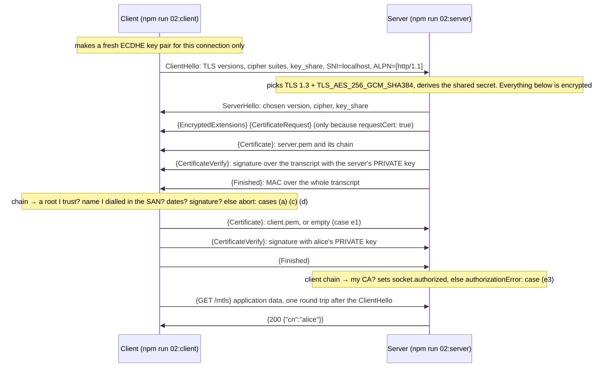

# 02 · TLS (what people still call SSL): the layer under everything else

> **TL;DR** — TLS turns a hostile network into a private, tamper-proof pipe to a server whose
> *name* you have verified. It gives three things: confidentiality (nobody reads), integrity
> (nobody changes) and server authentication (you are talking to the holder of a certificate
> for `bank.example`, signed by a CA your device trusts). Optionally a fourth: client
> authentication (mutual TLS), where the server verifies your certificate too. It does **not**
> authenticate a human, protect data at rest, or stop a phishing site that bought its own valid
> certificate. Every cookie in chapter 01 and every token in chapters 03 to 08 is a bearer secret
> that TLS alone keeps confidential in transit, so this chapter comes first. Use TLS 1.2 as the
> floor and 1.3 as the default. Never turn off certificate verification: `rejectUnauthorized:
> false` and `curl -k` hand the connection to whoever sits on the path.

## Why it was invented

### The world before it

In 1994 the web spoke HTTP in clear text over networks built for cooperative universities.
Anyone on the path (the coffee shop router, the ISP, the campus network, a compromised switch)
could do three things:

| Threat | What it looks like | What it costs you |
|---|---|---|
| Eavesdropping | `tcpdump` on any hop shows your password, your cookie, your card number | Account takeover, theft, surveillance |
| Tampering | The router rewrites the page: a different account number in the transfer form, a script injected into every page | Fraud, malware, session theft |
| Impersonation | A DNS or ARP trick sends you to a machine that *says* it is your bank | You type your password into the attacker's form |

Netscape wanted to sell e-commerce, and e-commerce needs a channel where the customer knows
who is at the other end and nobody in between can look. That channel is SSL.

### A short history

| Year | Milestone | Why it mattered |
|---|---|---|
| 1994 | SSL 1.0 designed at Netscape, never shipped | Broken in internal review before release |
| 1995 | SSL 2.0 ships in Netscape Navigator | First deployed version. Weak MAC, no handshake protection, same key for encryption and integrity. Prohibited by RFC 6176 (2011) |
| 1996 | SSL 3.0 (Paul Kocher with Netscape) | A near rewrite. The design TLS still follows. Deprecated by RFC 7568 (2015) after POODLE |
| 1999 | TLS 1.0, RFC 2246 | Handed to the IETF; renamed to end the Netscape vs Microsoft fight. Small changes from SSL 3.0, a new name |
| 2006 | TLS 1.1, RFC 4346 | Explicit IVs against CBC attacks (the BEAST class), padding fixes |
| 2008 | TLS 1.2, RFC 5246 | SHA-256, AEAD ciphers (AES-GCM), negotiable hashes. Still the floor today |
| 2011 | BEAST | Chosen-plaintext attack on CBC in TLS 1.0 from a hostile web page: decrypts cookies byte by byte |
| 2014 | Heartbleed (CVE-2014-0160) | Not a protocol flaw: a buffer over-read in OpenSSL's heartbeat code that leaked server memory, private keys included. Half a million sites re-keyed. Lesson: the implementation is part of the security |
| 2014 | POODLE | Padding oracle in SSL 3.0, reachable by forcing a downgrade. Killed SSL 3.0 for good |
| 2015 | FREAK, Logjam | Downgrade to 1990s "export" cipher suites still supported for compatibility. Lesson: every weak option you keep is an option the attacker chooses |
| 2015 | Let's Encrypt | Free, automated certificates. Encrypted page loads went from about 40 % to over 80 % in five years (Firefox telemetry) |
| 2018 | TLS 1.3, RFC 8446 | Removed everything that had failed (RSA key transport, CBC, RC4, 3DES, SHA-1, compression, renegotiation). 1-RTT handshake, forward secrecy always, certificate encrypted |
| 2021 | RFC 8996 deprecates TLS 1.0 and 1.1 | Browsers had dropped them in 2020. AWS API endpoints require 1.2 since 2023 |

The pattern: SSL and TLS did not become secure by adding features. They became secure by
removing options. TLS 1.3 has 5 cipher suites; TLS 1.2 had over 300.

## How it works

### What you get, and what you do not

| TLS gives you | TLS does not give you |
|---|---|
| Confidentiality: a per-connection key nobody else has | Protection of data at rest: the server stores what you sent however it likes |
| Integrity: every record carries an authentication tag; a flipped bit ends the connection | Authentication of the *user*: it authenticates the server's name, and at most the client's key. Who is typing is chapters 01 and 09 |
| Server authentication: the peer proved it holds the private key of a certificate for the name you dialled, issued by a CA you trust | Protection against a phishing site: `bank-login.example` can get a perfectly valid certificate for `bank-login.example` in a minute, for free. The padlock means "encrypted to whoever controls this domain name", nothing more |
| Optionally client authentication (mutual TLS) | Hiding *who* you talk to: the server name (SNI) travels in clear text so the server can pick a certificate, unless Encrypted Client Hello is deployed; IP addresses, packet sizes and timing leak too |
| Forward secrecy (TLS 1.3, ECDHE): a key stolen next year does not decrypt traffic recorded today | End-to-end guarantees when a load balancer, CDN or proxy terminates TLS: from there on you trust the operator, not the protocol |

### Two kinds of keys

The whole design rests on keeping two things apart:

| Key | Lives | Used for | Where in this chapter |
|---|---|---|---|
| The certificate's key pair (long-lived, identity) | Months; on the server's disk, an HSM, or ACM | Only to **sign** the handshake, proving "I am the holder of this certificate". Never to encrypt data | `certs/server-key.pem`, `certs/client-key.pem` |
| Session keys (ephemeral, confidentiality) | One connection; in memory | Encrypt and authenticate every byte. Derived from an ECDHE exchange both sides compute and nobody transmits | Never written anywhere; `socket.getCipher()` tells you the algorithm |

Because the long-lived key only signs, stealing it later gives you the ability to *impersonate*
the server from now on, but not to *decrypt* what was recorded. That is forward secrecy, and
TLS 1.3 made it mandatory by removing RSA key transport.

### The TLS 1.3 handshake, one round trip

What happens when `npm run 02:client` opens a connection to `npm run 02:server`. Braces mean
"already encrypted with handshake keys":



Step by step, and why each step exists:

1. **ClientHello.** The client offers what it can do (versions, cipher suites, signature
   algorithms) and, new in 1.3, already sends its ephemeral ECDHE public key (`key_share`).
   Two extensions matter to everything above TLS: **SNI** (server name indication, RFC 6066)
   tells a server hosting many sites which certificate to present, and **ALPN** (RFC 7301)
   negotiates the application protocol (`h2`, `http/1.1`) inside the handshake instead of
   needing another round trip. Both are in clear text; nothing else is after this point.
2. **ServerHello.** The server picks one version and one cipher suite and sends its own
   `key_share`. Both sides now compute the same shared secret (Diffie-Hellman) and derive the
   handshake keys. In 1.2 the certificate was sent in the clear; in 1.3 everything from here on
   is encrypted, including who the server is.
3. **Certificate.** The server's certificate, plus the intermediates needed to reach a root
   (servers send the leaf and the intermediates, not the root: the client must already have the
   root, or nothing was proven). A certificate binds a *name* to a *public key* with a CA's
   signature.
4. **CertificateVerify.** The server signs the transcript so far with the private key matching
   that certificate. This is the proof of possession. Without it anyone could replay a
   certificate they downloaded from the real site (certificates are public).
5. **Finished.** A MAC over the transcript with the handshake keys: proves both sides saw the
   same messages, so nobody stripped a cipher suite or downgraded the version on the way.
6. **The client decides.** Chain to a trusted root, signature valid, dates valid, name in the
   SAN, key usage right, and (browsers) revocation and Certificate Transparency. Any failure
   and the client sends an alert and hangs up. The server never learns why; look at case (a)
   in the server log: `handshake failed: socket hang up`.
7. **Client certificate (optional).** If the server sent `CertificateRequest`, the client
   answers with its own Certificate and CertificateVerify, or with an empty Certificate. The
   server verifies against *its* trust store (`ca` option, here the lab CA). Node exposes the
   result as `socket.authorized` and `socket.authorizationError`.
8. **Application data.** One round trip after the ClientHello the request is on its way.
   TLS 1.2 needed two.

**Resumption and 0-RTT.** After a full handshake the server can hand the client a session
ticket (a pre-shared key, PSK). The next connection presents it and skips the certificate work;
with 0-RTT the client even sends application data in its first flight. Two caveats. Tickets are
usually encrypted with a server-side key (STEK); if that key lives for months, it undoes forward
secrecy for every resumed session, so rotate it (hours, not months). And 0-RTT data can be
**replayed** by anyone who captured it: the server has not yet contributed randomness. Only
allow it for idempotent requests, or not at all (Node's `https` does not enable it).

### What the client checks in a certificate

| Check | How | What breaks if you skip it | Case in the demo |
|---|---|---|---|
| Chain of trust | Leaf → intermediate(s) → a root in the client's trust store; every signature verified with the parent's public key | Anyone mints a certificate with your name on it | (a) untrusted CA, (c) rogue CA |
| Signature and key usage | The parent's `basicConstraints = CA:TRUE`; the leaf's `extendedKeyUsage` fits the role (`serverAuth`, `clientAuth`) | A client certificate is reused to run a server; a leaf signs other certificates | `certs.ts`, `make-certs.sh` extensions |
| Validity period | `notBefore <= now <= notAfter` | Stolen old keys stay useful forever | 1-day certificates, `openssl x509 -dates` |
| Name | The name you dialled is in `subjectAltName` (DNS or IP). CN is ignored (RFC 6125, RFC 9525; Chrome since 2017) | A valid certificate for `evil.example` impersonates `bank.example` | (d) `ERR_TLS_CERT_ALTNAME_INVALID` |
| Proof of possession | `CertificateVerify` signature checks out against the certificate's public key | Replay of a public certificate | every successful case |
| Revocation (weak) | CRL (RFC 5280) or OCSP (RFC 6960); browsers mostly soft-fail | A revoked key keeps working | not in the lab; see below |
| Transparency (browsers) | Signed Certificate Timestamps from public CT logs (RFC 6962) | A CA mis-issues silently | not in the lab; private CAs do not log |

### Trust stores

A trust store is a list of root certificates the verifier accepts without proof. Your laptop
has one (about 150 roots), Node bundles its own (Mozilla's list; `--use-openssl-ca` or
`--use-system-ca` switch it), Java has `cacerts`, curl uses the OS or a `ca-bundle.crt`, and
every Docker base image carries one that ages with the image. The store *is* the security
boundary: every root in it can issue a certificate for any name. That is why case (a) fails and
why `rejectUnauthorized: false` is never the fix; add the right CA (`ca: labCa`) instead, or
install it in the OS store on managed devices.

### Revocation, and why it is weak

A private key leaks; the CA revokes the certificate. Two mechanisms tell clients:

| Mechanism | How | Problem |
|---|---|---|
| CRL, certificate revocation list | The CA publishes a signed list; the client downloads it | Big, slow, cached for days |
| OCSP, online certificate status protocol | The client asks the CA "is serial X good?" per connection | Slow, leaks browsing to the CA, and if the responder is down browsers *soft-fail*: they proceed as if fine, so an attacker who can MITM you can also block OCSP |
| OCSP stapling | The server fetches its own OCSP response and staples it into the handshake | Optional unless the cert has `Must-Staple` (RFC 7633), which almost none do |
| Browser summaries | Chrome CRLSets, Firefox CRLite: pushed lists of important revocations | Cover a subset |

The industry's answer is to make revocation matter less: short lifetimes. Let's Encrypt issues
90-day certificates, offers 6-day ones, and stopped OCSP in 2025 in favour of CRLs. The
CA/Browser Forum ballot passed in 2025 cuts public certificate lifetime from 398 days to 200
(March 2026), 100 (March 2027) and 47 days (March 2029). A 47-day certificate is its own
revocation. Our lab certificates live one day for the same reason.

### Certificates, the deep dive

An X.509 certificate (RFC 5280) is a signed statement: *this public key belongs to this name,
says this issuer, between these dates, for these purposes*. The fields you will read:

| Field | Meaning | In `certs/server.pem` |
|---|---|---|
| Subject | Who this is. Only `CN` for ours; public CAs add O, C for OV/EV | `CN=localhost` |
| Issuer | Who signed it; must equal the parent's Subject | `CN=Lab CA` |
| Serial number | Unique per CA (RFC 5280). Browsers reject reuse; we use a random 128-bit one | random |
| Validity | `notBefore`, `notAfter` | 1 day |
| Subject public key | The key the handshake proves possession of | P-256 ECDSA |
| `subjectAltName` | The names this cert is valid for: DNS, IP, email, URI. The **only** field name checks read | `DNS:localhost, IP:127.0.0.1, IP:::1` |
| `basicConstraints` | `CA:TRUE` may sign certificates; `pathlen` limits depth | `CA:FALSE` (leaf), `CA:TRUE, pathlen:0` (roots) |
| `keyUsage` | What the key may do: `digitalSignature`, `keyCertSign`, `cRLSign` | `digitalSignature` |
| `extendedKeyUsage` | The role: `serverAuth`, `clientAuth`, `codeSigning`, `emailProtection` | `serverAuth`; client certs get `clientAuth` |
| `subjectKeyIdentifier`, `authorityKeyIdentifier` | Hashes that let clients find the right parent when a CA has rotated keys | present |
| AIA, CRL distribution points | Where to fetch the issuer certificate, OCSP and CRLs. Public certs only | absent (private CA) |
| SCT list | Certificate Transparency proofs. Public certs only | absent |

Read every field of ours: `openssl x509 -in chapters/02-tls/certs/server.pem -noout -text`.

Choices you make when you ask for a certificate:

| Decision | Options | Pick |
|---|---|---|
| Who signs | **Self-signed**: subject = issuer, nobody vouches. **CA-signed**: a third party you already trust vouches | Self-signed only for a root, or a one-off local test. Everything else CA-signed, so clients trust one root and you can rotate leaves freely |
| Which CA | **Public** (Let's Encrypt, Amazon Trust Services, DigiCert): in every browser, must follow CA/B Forum rules, CT-logged, public names only. **Private** (ACM Private CA, step-ca, your own `openssl`): you install the root on your own clients, any names, no CT | Public for anything a browser or a customer must trust. Private for service-to-service, devices, mTLS. Never ask customers to install your root |
| Names | **SAN list**: explicit names, one cert can cover `www`, `api`, an IP. **Wildcard** `*.example.com`: any one label | SAN. A wildcard key on many hosts means one leak impersonates all of them; wildcards also cannot cover `example.com` itself or two levels |
| How to get it | **ACME** (RFC 8555): the CA challenges you to prove control of the name (HTTP-01 file, DNS-01 TXT record, TLS-ALPN-01), then issues, all by script. Certbot, `acme.sh`, ACM's DNS validation, `lego` | ACME or a managed service. A certificate a human renews is a certificate that expires on a weekend |
| Validation level | **DV**: control of the domain. **OV/EV**: a legal identity check | DV. Browsers stopped showing EV differently in 2019; it bought nothing users noticed |

### Mutual TLS

In plain TLS the client stays anonymous at the transport layer and proves who it is later
(password, cookie, token). In mutual TLS the client also holds a certificate and the server
verifies it during the handshake: authentication happens *before* the first byte of HTTP, with
a key that was never sent over the wire and cannot be phished. Node: `requestCert: true` makes
the server ask; `rejectUnauthorized: true` drops handshakes that do not verify; with `false`
(this chapter) the route reads `socket.authorized` and decides.

| Where mTLS fits | Why | Example |
|---|---|---|
| Service to service | Machines can hold keys and rotate them; no human to phish; identity travels with the connection | Kubernetes service meshes (Istio, Linkerd), SPIFFE/SPIRE: every workload gets a short-lived X.509 "SVID" with a `spiffe://trust-domain/ns/x/sa/y` URI SAN; ECS Service Connect TLS; VPC Lattice |
| Partner and banking APIs | mTLS proves possession on every connection and can bind OAuth tokens to that client key (RFC 8705). A normal PEM key is copyable; use an HSM/TPM/Secure Enclave when policy requires non-exportability | Open Banking, PSD2, payment networks |
| Managed corporate devices | The device proves it is company-issued before the human proves anything | Device certificates from MDM; zero-trust access gateways |
| Humans in general | Rare: enrolment, renewal and revocation per person are painful, browsers' UI is bad, and phones and shared machines break the model. Passkeys (chapter 09) give the same phishing resistance with a better UX | Smart cards in governments and militaries (PIV, CAC) |

## Run it

Everything is TypeScript run with `tsx`, plus the system `openssl` for the certificates.

```bash
# 1. make the lab PKI (two CAs, two servers, two clients) into chapters/02-tls/certs/
npm run 02:certs

# 2. one terminal: the server on https://localhost:4443
npm run 02:server

# 3. another terminal: the client runs cases (a) to (e) and exits 0 when TLS behaved
npm run 02:client

# 4. the same facts as tests (certs into a temp dir, servers on port 0)
npx vitest run chapters/02-tls
```

What you see, and what to look at:

**`02:certs`** prints what every file is, then the server certificate as `openssl` reads it
(`subject=CN=localhost`, `issuer=CN=Lab CA`, dates one day apart, the SAN list), then verifies
the chain the way a client will: `server.pem: OK` against `ca.pem`, `verification failed` for
`rogue-server.pem`. Two roots, two worlds.

**`02:server`** logs one block per handshake, from the `secureConnection` event, before any
HTTP is read: protocol, cipher, SNI, ALPN, and the client certificate situation (`none`,
`authorized`, or `NOT authorized (UNABLE_TO_VERIFY_LEAF_SIGNATURE)`). Failed handshakes show as
`handshake failed: socket hang up`: the client saw the certificate and walked away, and the
server never learns why. That is by design; the client owes an attacker no explanation.

**`02:client`** runs the cases and says why each ended the way it did:

| Case | What the client does | Result | The lesson |
|---|---|---|---|
| (a) | Connects with Node's default trust store | `SELF_SIGNED_CERT_IN_CHAIN` (or `UNABLE_TO_VERIFY_LEAF_SIGNATURE` if the server sends only the leaf) | The lab CA is in nobody's store. Trust lives in the verifier, not in the certificate |
| (b) | `ca: ca.pem` | `200` over `TLSv1.3`, `TLS_AES_256_GCM_SHA384`; prints the chain leaf → root with subject, issuer, validity, SAN, fingerprint | Five checks passed: chain, signature, dates, name, possession |
| (c) | Starts a second server with `rogue-server.pem`, still trusts only `ca.pem` | rejected, same code as (a) | Same CN, same SAN, valid dates. Only the signature differs, and only the signature counts |
| (d) | Dials `127.0.0.1`, asks for `servername: 'nothere.example'` | `ERR_TLS_CERT_ALTNAME_INVALID` | Trusted chain, wrong name. Without this check any valid certificate impersonates any site |
| (e1) | `GET /mtls` with no client certificate | `401 client_certificate_required` | The server asked; the client sent an empty Certificate |
| (e2) | `GET /mtls` with `client.pem` + `client-key.pem` | `200 {"cn":"alice"}` | Alice signed the transcript; her cert chains to the server's CA. Authenticated by TLS, no password, nothing secret on the wire |
| (e3) | `GET /mtls` with `rogue-client.pem` (also says `CN=alice`) | `401 client_certificate_not_trusted` | The server does not care what the certificate says, only who signed it. Case (c) in the other direction |

Why (a) reports `SELF_SIGNED_CERT_IN_CHAIN` and not the more common
`UNABLE_TO_VERIFY_LEAF_SIGNATURE`: our server's `ca` option (meant for verifying *clients*) also
puts the lab root in OpenSSL's store, and OpenSSL completes the outgoing chain from that store,
so the server sends leaf + root. Real servers send leaf + intermediates, and a client that does
not know the root sees "unable to verify the first certificate". Both mean the same: nothing
in the chain reaches a root I trust.

Poke at it by hand:

```bash
CERTS=chapters/02-tls/certs

# curl, like a browser: fails, then works with the lab root, then mTLS
curl https://localhost:4443/
curl --cacert $CERTS/ca.pem https://localhost:4443/
curl --cacert $CERTS/ca.pem https://localhost:4443/mtls                 # 401
curl --cacert $CERTS/ca.pem --cert $CERTS/client.pem --key $CERTS/client-key.pem https://localhost:4443/mtls

# the handshake itself: chain, protocol, cipher, "Verify return code: 0 (ok)"
openssl s_client -connect localhost:4443 -servername localhost -CAfile $CERTS/ca.pem </dev/null

# every field of a certificate
openssl x509 -in $CERTS/server.pem -noout -text
```

Under the hood: `src/certs.ts` and `scripts/make-certs.sh` build the same PKI (EC P-256 keys,
`openssl req` for CSRs, `openssl x509 -req -extfile` so the *CA* decides the extensions);
`src/server.ts` is `node:https` with `minVersion: 'TLSv1.2'`, `requestCert: true`,
`rejectUnauthorized: false`; `src/client.ts` is `node:https` requests with `agent: false` so
every case is a full handshake; `src/tls.test.ts` holds 13 tests including "a client that can
only do TLS 1.1 gets alert 70, protocol_version".

## Scenarios

### Where you meet it

| Situation | TLS role | Notes |
|---|---|---|
| Any website | Server auth + encryption. The browser is the client with the OS or Mozilla trust store | HSTS (RFC 6797) makes the browser refuse plain HTTP for the site afterwards |
| Mobile app to API | Same, plus optional certificate pinning in the app | Pin to your CA or a backup key, never only to the current leaf (see pitfalls) |
| Microservice to microservice | mTLS: both sides are machines with rotating certificates | Meshes and SPIFFE automate issuance and rotation; without automation mTLS rots |
| Database connections | Server auth + encryption; sometimes client certs instead of passwords | `sslmode=verify-full` in PostgreSQL; `verify-ca` skips the hostname check and is a common mistake |
| Email between servers | Opportunistic TLS (STARTTLS), often unauthenticated | MTA-STS and DANE add authentication |
| VPNs, zero-trust gateways | TLS or IPsec with device certificates | The device certificate is the mTLS client cert |
| Every IdP flow in this lab | The authorization code, the id_token, the SAML assertion, the session cookie all ride on TLS | Chapters 05 to 08 assume it. RFC 8705 and DPoP (RFC 9449) go further and bind tokens to a key so a stolen token is useless without it |

### AWS

| Service | What it does for TLS | Details that matter |
|---|---|---|
| **ACM** (AWS Certificate Manager) | Free public certificates from Amazon Trust Services, DNS-validated, renewed automatically, private key never leaves AWS | Only usable on integrated services (ALB, NLB, CloudFront, API Gateway, App Runner...). Exportable public certificates arrived in 2025 for a fee. Renewal fails silently if you delete the validation CNAME: alarm on `DaysToExpiry` |
| **AWS Private CA** (formerly ACM Private CA) | A managed CA hierarchy: root and subordinates, issuance API, CRL/OCSP, short-lived certificates | The private PKI for mTLS, internal services, devices. Billed per CA per month plus per certificate. Integrates with ACM, EKS (cert-manager), ECS Service Connect, IAM Roles Anywhere |
| **ALB** | Terminates TLS with a **security policy** (use the TLS 1.3 policies; the default still allows 1.2 with older ciphers), SNI for many certificates per listener, re-encrypts to targets over HTTPS if you configure HTTPS target groups | **mTLS on ALB**: a trust store (PEM bundle in S3) in *verify* mode, or *passthrough* mode that forwards the client cert in `X-Amzn-Mtls-Clientcert-*` headers for the app to check |
| **NLB** | TLS listeners (terminate with an ACM cert) or TCP passthrough to let targets do TLS themselves | Passthrough keeps end-to-end TLS; the LB cannot inspect anything, which can be the point |
| **CloudFront** | *Viewer protocol policy* (redirect HTTP → HTTPS or HTTPS only), *origin protocol policy* (HTTPS only, and match viewer), minimum protocol via a security policy (`TLSv1.2_2021`) | The ACM certificate must live in `us-east-1`. Origin certificates must be publicly trusted and match the origin domain: CloudFront is a normal client |
| **API Gateway** | TLS 1.2 minimum on custom domains; **mTLS** with a trust store bundle in S3 | Disable the default `execute-api` endpoint or clients bypass mTLS by calling it directly. REST and HTTP APIs both support it |
| **ECS Service Connect, App Mesh** | Automatic TLS between services with certificates from AWS Private CA; the Envoy sidecar handles it | App Mesh is being retired (end of support 2026); Service Connect is the current path. Mutual TLS between tasks with no code change |
| **VPC Lattice** | TLS termination or passthrough for service-to-service, plus auth policies (IAM/SigV4) | Application-layer identity (SigV4) on top of transport TLS |
| **RDS, Aurora, ElastiCache** | TLS to the database; `rds.force_ssl` (PostgreSQL), `require_secure_transport` (MySQL), in-transit encryption for Redis/Valkey/Memcached | Download the regional RDS CA bundle and use `verify-full`; the 2024 rotation to `rds-ca-rsa2048-g1` broke clients that had pinned the old root |
| **S3 and every AWS API** | TLS 1.2 minimum since 2023. Bucket policy `Deny` when `aws:SecureTransport` is `false` blocks plain HTTP | The condition key exists for most services; use it in SCPs too |
| **IAM Roles Anywhere** | Workloads outside AWS present an X.509 certificate from your CA and get temporary IAM credentials | Certificate-based identity turned into IAM: the mTLS idea applied to cloud credentials |
| **Nitro** | Traffic between Nitro-based instances in the same VPC or Region is encrypted at the hardware layer | Nice, but it is not authentication and not end to end; keep TLS |
| **Cognito, Identity Center, IAM** | Serve their endpoints over TLS with ACM certificates; nothing to configure | Your app's redirect URIs must be HTTPS (except `localhost`) or the flow is refused |

### Amazon internal (public knowledge only)

Amazon runs its own internal PKI for service-to-service authentication, and corporate SSO
(Federate, Midway) is delivered over TLS to managed devices that carry the corporate roots,
the same pattern as any large company: public CA at the edge, private CA inside, mTLS between
machines. Amazon also operates a public CA, Amazon Trust Services, whose roots are in every
browser and which issues the certificates ACM hands out.

### Relation to the rest of the lab

Chapter 01's session cookie, chapter 03's JWT, chapter 05's access token, chapter 06's id_token,
chapter 08's SAML assertion: all bearer secrets. Whoever holds the bytes is the user. Only TLS
keeps those bytes from the network, and only TLS makes the browser sure the `Set-Cookie` and
the `redirect_uri` came from the real issuer. When a chapter says "over HTTPS", it means every
check in the table above, with no exceptions. Chapter 05 also shows how mTLS (RFC 8705) and
DPoP bind a token to a key so that even a leaked token is not enough.

## Pros and cons

**Pros**

- Universal: every language, device and network stack speaks it; applications get it for free.
- Strong by default in 1.3: forward secrecy in every full handshake, only AEAD ciphers,
  encrypted certificates, one round trip, downgrade protection.
- The public PKI works at internet scale: free automated certificates, Certificate
  Transparency, browser enforcement of CA rules.
- Cheap: hardware AES and ECDHE make the CPU cost small; session resumption removes handshakes.
- mTLS gives machines a phishing-resistant proof of key possession; hardware-backed
  non-exportable keys also prevent copying, while ordinary PEM keys do not.

**Cons**

- Trust is only as good as ~150 root CAs and everyone who can install one on your device
  (corporate proxies, malware, a 2014 base image). One bad root breaks every name.
- Revocation is broken in practice; short lifetimes are the workaround and they cause outages
  when automation fails.
- Metadata leaks: SNI, IP addresses, sizes, timing. ECH is still being deployed.
- It stops at the terminator: load balancers, CDNs and TLS-inspecting proxies see plaintext.
- Operating a private PKI is real work (issuance, rotation, distribution of roots, revocation).
- mTLS for humans has poor UX and hard lifecycle; 0-RTT resumption allows replay.

## Alternatives

| Alternative | What it is | Pick it when |
|---|---|---|
| **SSH** | Its own transport with host keys (trust on first use) and user keys or SSH certificates | Remote shells, git, tunnels. Not for HTTP clients |
| **WireGuard, IPsec/IKEv2** | Encryption at the network layer for everything between two hosts or networks; WireGuard uses the Noise framework with static keys, IPsec uses certificates or PSKs | Site-to-site links, VPNs (AWS Site-to-Site VPN is IPsec). You still want TLS inside for per-service identity |
| **QUIC** (RFC 9000, RFC 9001) | UDP transport with TLS 1.3 built into the handshake; HTTP/3 runs on it | You get TLS anyway; QUIC is a transport choice (fewer round trips, no head-of-line blocking) |
| **Noise protocol framework** | A toolkit of handshake patterns with static public keys and no certificates | Peer-to-peer systems that manage keys themselves (WireGuard, messaging apps) |
| **Message-level security: JWS/JWE (chapter 03), COSE, SigV4** | Sign or encrypt the payload, not the channel | The message crosses queues, storage or untrusted intermediaries, or must be verifiable later. AWS APIs sign every request with SigV4 *and* use TLS: the signature gives request authentication, TLS gives confidentiality |
| **Kerberos (chapter 04)** | Mutual authentication and session keys from a trusted third party, no PKI | Inside a Windows or Unix domain; not on the public internet |
| **DTLS** | TLS over UDP | VoIP media (WebRTC), IoT |

## Pitfalls

Each one with the attack it enables:

| Pitfall | The attack |
|---|---|
| `rejectUnauthorized: false`, `NODE_TLS_REJECT_UNAUTHORIZED=0`, `curl -k`, `verify=False`, `InsecureSkipVerify` | Any machine on the path terminates your TLS with its own certificate and reads and rewrites everything. Case (a) shows the "annoying" error that pushes people to it; `ca: labCa` is the fix, not turning checks off. Grep your repos for these strings |
| Trusting unaudited CA bundles: whatever the base image shipped, a corporate interception root pushed to every laptop, "just add this root" in a README | Any of those CAs mints a valid certificate for any name: Superfish (2015) shipped a root *and its private key* on consumer laptops; DigiNotar (2011) issued `*.google.com` to an attacker. Keep stores small, patched and reviewed |
| Pinning the leaf certificate or key without a rotation plan | Your own outage when the certificate rotates; HPKP was removed from browsers in 2019 for exactly this. Pin the CA or a backup key, monitor CT logs instead |
| Allowing TLS 1.0/1.1, SSL 3.0, RC4, 3DES, CBC-SHA1, export or anonymous cipher suites "for old clients" | Downgrade attacks: POODLE, FREAK, Logjam, Sweet32. The attacker picks the weakest option you left on. Floor at 1.2 with AEAD suites; the test `refuses a client that can do at most TLS 1.1` is the check |
| Mixed content: an HTTPS page loading a script or frame over HTTP | The MITM replaces the script and owns the page, padlock and all. Browsers block active mixed content now; set `Strict-Transport-Security` with preload |
| Expired certificates nobody monitors | Outage (Microsoft Teams 2020, Spotify 2020, Ericsson's mobile networks 2018), and worse: the emergency fix is often pitfall one. Automate (ACME, ACM) and alarm at 30 days |
| Shared, long-lived private keys copied to many hosts, repos or laptops | One leak (Heartbleed, a git commit, a stolen laptop) impersonates everything the key serves, forever until revocation, which is weak. Per-host keys, short lifetimes, keys in ACM/KMS/HSM that cannot be exported |
| Terminating TLS at the load balancer and going plaintext inside the VPC "because it is private" | A compromised pod, a wrong security group, a peered VPC or an insider reads every request and every bearer token; the app also loses the client's identity. Re-encrypt to targets, use Service Connect or a mesh, and set `X-Forwarded-Proto` correctly |
| Checking CN instead of SAN, or disabling hostname verification (`verify-ca`, `ALLOW_ALL_HOSTNAME_VERIFIER`) | Any valid certificate for any name impersonates yours, case (d) turned off. Modern clients ignore CN entirely (RFC 9525), so CN-only certificates also fail in Chrome |
| Self-signed certificates in production | Clients must either disable verification (pitfall one) or pin one certificate (pitfall three); no rotation, no revocation. Use a private CA (AWS Private CA, step-ca) or a public one |
| `requestCert: true, rejectUnauthorized: false` and then forgetting `socket.authorized` in the handler | Anyone with *any* certificate, or none, gets in while the logs say "mTLS". This chapter uses that mode on purpose to show both paths; `/mtls` checks `authorized`. If a listener only serves machines, set `rejectUnauthorized: true` and let the handshake fail |
| Assuming TLS means the *user* is authenticated, or that the padlock means the site is legitimate | Phishing sites have valid certificates; TLS says nothing about who is typing. Authentication is chapters 01, 06 and 09 |

## Further reading

- RFC 8446, *The Transport Layer Security (TLS) Protocol Version 1.3* (2018). Readable; start with sections 1 and 2.
- RFC 5246, TLS 1.2 (2008), for the protocol most of the world still allows as a floor.
- RFC 5280, *Internet X.509 Public Key Infrastructure Certificate and CRL Profile* (2008). What every field means.
- RFC 6125 (2011) and RFC 9525 (2023), *Service Identity in TLS*: how names are checked, why CN is dead.
- RFC 6066, TLS extensions (SNI, OCSP status request); RFC 7301, ALPN.
- RFC 8555, *Automatic Certificate Management Environment (ACME)* (2019).
- RFC 8705, *OAuth 2.0 Mutual-TLS Client Authentication and Certificate-Bound Access Tokens* (2020).
- RFC 7568 and RFC 8996: deprecating SSL 3.0 and TLS 1.0/1.1. RFC 6176: prohibiting SSL 2.0.
- RFC 6962, *Certificate Transparency*; RFC 7633, OCSP Must-Staple; RFC 6797, HSTS.
- CA/Browser Forum, *Baseline Requirements for TLS Server Certificates*, and ballot SC-081 (2025) on the 47-day lifetime schedule.
- Node.js documentation: [`tls`](https://nodejs.org/api/tls.html) and [`https`](https://nodejs.org/api/https.html), especially `tls.connect` options, `TLSSocket.getPeerCertificate`, `authorized`, `authorizationError`.
- OpenSSL `x509`, `req`, `verify`, `s_client` manual pages, and the `x509v3_config` page for the extension syntax used in `make-certs.sh`.
- SPIFFE, *Secure Production Identity Framework for Everyone*: the X.509 SVID specification, for how meshes do mTLS identity.
- AWS: *Elastic Load Balancing security policies*, *Mutual authentication with TLS in Application Load Balancer*, *Configuring mutual TLS authentication for a REST API* (API Gateway), *AWS Private CA User Guide*, *Using SSL/TLS to encrypt a connection to a DB instance* (RDS).
