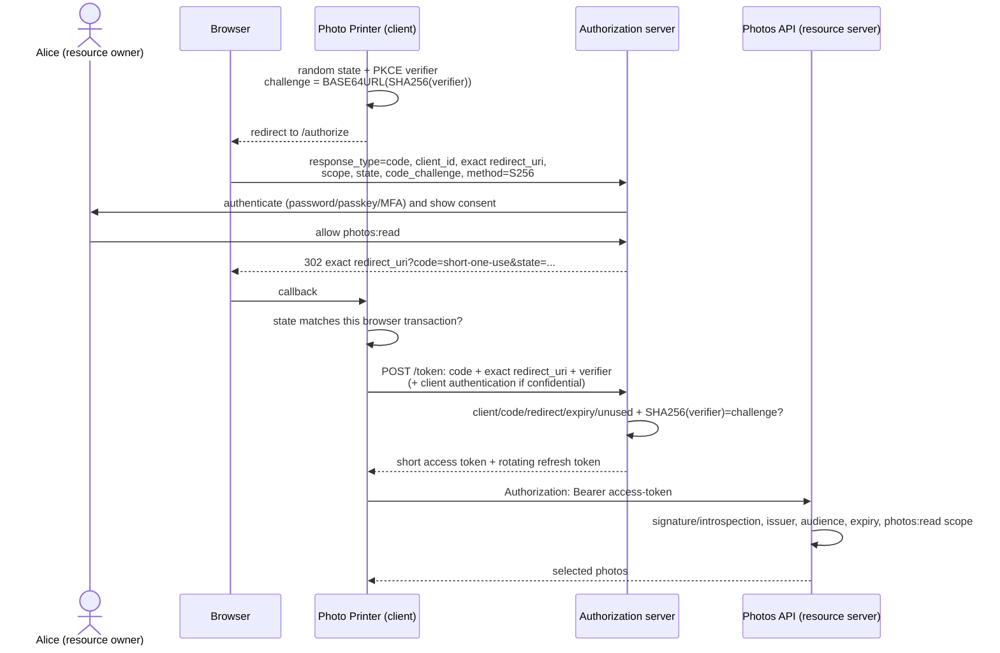

# 05 · OAuth 2.0: delegated API access without sharing a password

> **TL;DR** — OAuth lets a resource owner authorize a client to call a resource server with
> limited scope, without giving the client the owner's password. The authorization server issues
> an access token for the API; that token is authority, not a standardized proof of login. For a
> user-facing app use Authorization Code + PKCE, exact redirect URIs, one-use `state` and short
> codes/access tokens; rotate refresh tokens. For machine-to-machine use Client Credentials, whose
> subject is the workload—not a human. Never use Implicit or Resource Owner Password grants in new
> systems. Add `scope=openid` and validate an ID token when the client needs authentication: that
> layer is OpenID Connect (chapter 06).

## Why it was invented

Before delegated authorization, a third-party app that wanted your data often asked for your
username and password. A photo-printing site asked for your photo-site password; an address-book
importer asked for your email password. That was broken:

- The third party received permanent access to everything the password could do.
- It could impersonate the user, change the password, or read unrelated data.
- The resource server could not distinguish user actions from third-party actions.
- Revoking one app required changing the password, breaking every other app/device.
- MFA and risk checks could not be applied cleanly because the third party replayed credentials.

OAuth replaced “give the printer your photo password” with “send the user to the photo site; the
photo site asks whether this printer may read selected photos; give the printer a revocable,
limited credential.”

| Year | Milestone | Why it mattered |
| --- | --- | --- |
| 2006 | Flickr, Google AuthSub and others expose proprietary delegated-access flows | The problem was real, but every provider invented incompatible rules |
| 2007 | OAuth 1.0 community specification | One open protocol; every API request cryptographically signed, complex but not bearer-by-default |
| 2010 | OAuth 1.0 becomes RFC 5849 | Standards-track description of the original protocol |
| 2012 | OAuth 2.0 (RFC 6749) + Bearer Token Usage (RFC 6750) | Simpler framework based on TLS and access tokens; profiles for web, native and machine clients |
| 2015 | PKCE (RFC 7636) | A stolen authorization code is useless without a per-request verifier; first native apps, now every code client |
| 2019 | Device Authorization Grant (RFC 8628) | Safe authorization for TVs, CLIs and input-constrained devices |
| 2020 | Authorization Server Metadata (RFC 8414), token exchange/introspection/revocation ecosystem matures | Discovery and operational profiles become consistent |
| 2025 | OAuth 2.0 Security Best Current Practice (RFC 9700) | Retires unsafe flows/patterns and consolidates lessons from redirect, mix-up and token attacks |

OAuth 2.0 is a **framework**, not one wire protocol or token format. Profiles say which grants,
client authentication, token format and metadata a deployment supports. OpenID Connect is one
such identity layer. JWT access tokens (RFC 9068), opaque tokens and proof-of-possession tokens
all fit OAuth.

## How it works

### The four roles

Use the exact roles; replacing them with “frontend/backend” causes design mistakes.

| Role | In the photo-printing example | Responsibility |
| --- | --- | --- |
| Resource owner | Alice | owns or can authorize access to the photos |
| Client | Photo Printer | wants to act with limited delegated authority; it is not the resource owner |
| Authorization server (AS) | Photo site's login/consent/token service | authenticates Alice/client, records grant, issues/revokes tokens |
| Resource server (RS) | Photos API | owns protected data; validates token audience/expiry/scope before each operation |

One product may run AS and RS, but they are separate security roles. The API should not parse a
browser session from the client; it accepts an access token intended for itself. The client
should not inspect an opaque access token; it passes it to the API.

### Authorization Code + PKCE

This is the normal flow for web backends, browser apps, mobile/native apps and CLIs with a system
browser.



Every parameter has one job:

| Value | Who creates/checks it | Job |
| --- | --- | --- |
| `client_id` | AS assigns; client sends | public identifier selecting registration; never a secret |
| `redirect_uri` | pre-registered; AS exact-compares at both endpoints | only this endpoint may receive the code; prevents exfiltration |
| `scope` | client requests; owner/AS grants; RS enforces | bounds delegated capability, for example `photos:read` |
| `state` | client creates/stores and constant-time compares at callback | binds callback to initiating browser/session; CSRF/transaction mix-up defense |
| `code_challenge` | client derives from verifier | public commitment sent in front channel |
| `code_verifier` | client keeps, token endpoint checks | proof the redeemer is the same client instance that began the flow |
| authorization code | AS creates, browser carries, client redeems | short, single-use handle; not an API token |
| client secret | only a confidential backend and AS | authenticates the client installation; not possible in downloaded/public code |

PKCE does not replace `state`; client authentication does not replace PKCE; TLS is required for
all real endpoints. They close different attacks.

**Why consume the code after a bad attempt?** If an intercepted code could be retried indefinitely,
an attacker gets repeated verifier/client/redirect guesses. A code gets one redemption attempt,
expires in about a minute and is bound to client + exact redirect + challenge.

### Public vs confidential clients

| Client | Can keep a secret? | Examples | Correct control |
| --- | --- | --- | --- |
| Confidential | yes, in a backend/HSM/secret store | server-rendered app, BFF, daemon | authenticate at token endpoint **and** use PKCE for user flow |
| Public | no; every installed copy/user can extract it | SPA JavaScript, native/mobile app, desktop CLI | no pretend secret; Authorization Code + PKCE |

A string bundled in JavaScript, a mobile binary or a desktop executable is not a client secret.
It may identify the app build but cannot authenticate it. A backend-for-frontend keeps OAuth
tokens and the real secret server-side, giving the browser only an HttpOnly local session cookie.

Native apps should use the system browser (RFC 8252), claimed HTTPS/app links or loopback
redirects, never an embedded webview that can read credentials. Browser apps follow the current
browser-based-app profile; a BFF is the strongest general default.

### Access and refresh tokens

| Token | Consumer | Lifetime | Meaning |
| --- | --- | --- | --- |
| Access token | one resource server/audience | minutes | bearer/sender-constrained delegated authority + scopes |
| Refresh token | authorization server only | hours/days, policy-dependent | renew access without user interaction; high-value credential |
| Authorization code | token endpoint only | roughly 30–60 seconds, one use | transfer the grant through an exposed browser channel |
| ID token (OIDC) | client | minutes | authentication result; **not OAuth by itself**, chapter 06 |

OAuth does not require JWT. An access token may be a random reference checked with RFC 7662
introspection or a self-contained JWT checked locally. Chapter 03 compares them.

Refresh best practice for public clients is rotation: each use returns a new refresh token and
invalidates the old. Reuse of an old member suggests theft; revoke the entire token family and
force reauthorization. A refresh request may keep or **narrow** scope, never expand beyond the
original grant. Store refresh tokens in a backend/OS protected storage, not browser localStorage.

### Bearer vs sender-constrained

A bearer token belongs to whoever possesses the bytes. `Authorization: Bearer ...` is cash:
there is no second proof that the presenter is the original client. Protect it with TLS, short
lifetimes, audience restriction, safe endpoint storage and logging redaction.

Two standards bind tokens to a key:

- **OAuth mTLS** (RFC 8705): client proves a certificate private key during TLS; token's `cnf`
  claim/reference identifies that certificate.
- **DPoP** (RFC 9449): client signs a fresh proof JWT over method, URI, time, nonce and token hash;
  token is bound to that public key.

A copied token then lacks the key. Neither helps when malware controls the legitimate client and
can ask its key to sign.

### Scopes are delegation, not user roles

`orders:write` says the **client** was granted authority to attempt that API capability on behalf
of a subject. It does not say the user is an administrator or owns order 42.

A normal decision is layered:

1. Gateway/resource server: token valid for this API? Does it have `orders:write`?
2. Service: is this user allowed to edit **this** order (owner, role, relationship, policy)?
3. Data layer: is tenant/row isolation enforced?

Groups/roles describe organisational identity; scopes describe client delegation; permissions
and relationships describe resource access. Chapter 12 implements all three layers.

### Consent is policy, not always a screen

Third-party clients need meaningful informed consent. A first-party payroll app may receive
administrator-preapproved scopes with no repetitive screen. Client Credentials has no human and
therefore no consent screen. The AS records grants/policy either way. Dark patterns and giant
“allow everything” scopes defeat the model even when the protocol is correct.

### Grant types

| Grant | Actor / scenario | Use now? |
| --- | --- | --- |
| Authorization Code + PKCE | human via browser; web/native/SPA/BFF | **yes**, default interactive flow |
| Refresh Token | renew previously granted access | yes, with rotation/sender constraints and protected storage |
| Client Credentials | confidential workload acting as itself | yes; no human/ID token; often cloud role/mTLS is better |
| Device Authorization (RFC 8628) | TV, game console, CLI without usable browser | yes; user authorizes on a second device; poll carefully |
| Token Exchange (RFC 8693) | broker/service exchanges one security context for audience-specific token | yes where federation/delegation profile needs it |
| JWT/SAML bearer assertion grants (RFC 7523/7522) | trusted assertion exchanged for access token | specialised federation/integration |
| Implicit | token returned in URL/front channel | **no new use**; Code + PKCE removes leakage/replay weaknesses |
| Resource Owner Password Credentials | client collects user's password | **no new use**; defeats delegation/MFA/federation and is omitted by modern guidance |

Other profiles exist (CIBA for decoupled approval, PAR/JAR/JARM for high-assurance request/response
protection). Choose a published profile for your ecosystem instead of inventing a grant.

### 401 vs 403

- `401 Unauthorized` means no acceptable authentication credential: missing, malformed, expired,
  wrong issuer/audience/signature/token kind. Include `WWW-Authenticate: Bearer error="invalid_token"`.
- `403 Forbidden` means token authentication succeeded but scope/permission is insufficient.
  For missing OAuth scope use `error="insufficient_scope"` and identify the required scope where
  revealing it is safe.
- `404 Not Found` may intentionally hide existence of a resource the authenticated user cannot
  know about; it is an application authorization decision.

## Run it

The demo is offline/in-process and reuses the small IdP protocol core:

```bash
npm run 05
npx vitest run chapters/05-oauth2
```

It shows:

1. pure OAuth Code + PKCE **without** `openid`: access + refresh token, no ID token;
2. the four roles and why an access token is not a login assertion;
3. exact redirect, wrong PKCE, code replay and insufficient-scope failures;
4. refresh rotation/reuse detection and no scope expansion;
5. Client Credentials whose subject is `client:thumbnail-worker`, not alice;
6. introspection/revocation and the bearer-token trade-off.

For a real localhost browser exchange, run the shared services:

```bash
npm run idp   # terminal 1
npm run api   # terminal 2
npm run rp    # terminal 3, then open http://127.0.0.1:4001
```

## Scenarios

**Print selected photos.** The motivating pattern: a third party receives `photos:read`, not the
password or delete/account-management authority. The resource owner can revoke only that client.

**A mobile banking app.** System browser + Code/PKCE authenticates/authorizes; access token targets
the bank API; high-risk payments require resource-level policy and step-up, not merely a broad
scope.

**Machine-to-machine.** A scheduled inventory process authenticates as a confidential workload
and gets `inventory:read`. There is no resource-owner login. On AWS, a workload IAM role is often
preferable because it avoids another static client secret.

**TV or CLI.** Device flow shows a short user code and verification URI. The constrained device
polls the token endpoint with a device code while the user signs in on a phone/laptop. The device
code is not the user code; polling handles `authorization_pending`, `slow_down`, expiry and denial.

### AWS mapping

| AWS service | OAuth role / behavior |
| --- | --- |
| Cognito user-pool domain / managed login | authorization server/OpenID Provider: `/oauth2/authorize`, `/oauth2/token`, `/oauth2/revoke`, `/oauth2/userInfo`; app client registrations and callback/logout URLs |
| Cognito resource server | defines custom OAuth scopes such as `orders/read`; app client may request allowed scopes; access token carries `scope` |
| Cognito app client | public (no secret) or confidential (secret). Supports code, refresh and client-credentials profiles; use Code+PKCE for interactive clients |
| API Gateway HTTP API JWT authorizer | resource-server enforcement point: validates issuer/audience/signature/time and route `authorizationScopes` before Lambda |
| Application Load Balancer `authenticate-oidc` | OAuth/OIDC client in front of targets; performs code flow, keeps its own session cookie, forwards signed identity context |
| IAM Identity Center CLI | browser PKCE or OAuth 2.0 Device Authorization flow obtains Identity Center tokens, then role credentials for selected account/permission set |
| AWS STS | **not OAuth**: AWS-specific temporary-credential service. AssumeRole/WebIdentity/SAML are analogous exchanges but produce SigV4 key triples, not OAuth access tokens |
| Secrets Manager | store confidential-client secrets; public clients must not receive one |
| WAF / API Gateway throttling | online abuse controls around authorization/token/API endpoints; protocol correctness does not rate-limit guessing |

Amazon employees may encounter **Federate** as a corporate federation/OAuth/OIDC touchpoint. At
public-knowledge level, treat it as an authorization/identity provider selected through internal
registration and policy. Do not infer private implementation details from the generic protocol.

## Pros and cons

**Pros**

- User never gives the client their resource-server password.
- Scope, audience, client and expiry make authority narrower and individually revocable.
- Supports browser/native/device/workload scenarios with standard profiles.
- Resource server can distinguish client, subject and delegated capabilities for audit/policy.
- Tokens can be opaque (central control) or self-contained (local verification).
- OIDC, mTLS, DPoP, introspection, revocation and token exchange extend the framework cleanly.

**Cons**

- Many actors, redirects and token kinds create configuration/validation complexity.
- Bearer-token theft is immediate authority until expiry/revocation.
- “Scope” semantics are provider/API specific; consent can be meaningless UX.
- Refresh tokens add long-lived state, rotation and theft-detection requirements.
- Browser storage, cross-site behavior and redirect handling remain difficult.
- OAuth alone does not authenticate a person to the client; using it as login without OIDC is
  underspecified and vulnerable.
- Authorization-server outage blocks new grants/refresh even if JWT APIs can verify existing access.

## Alternatives

| Instead of / need | Alternative | When |
| --- | --- | --- |
| third-party delegated API access | signed API request/key with manual provisioning | small fixed machine integration; you accept weaker user delegation/revocation UX |
| bearer access token | mTLS/DPoP sender-constrained token | theft/replay risk justifies client key management |
| OAuth client secret for AWS workload | IAM role (Lambda/ECS/EC2/EKS Pod Identity) | workload runs on AWS; short SigV4 credentials and no static app secret |
| JWT access token | opaque reference + introspection | immediate revocation/confidential claims outweigh the per-request lookup |
| OAuth as login | OpenID Connect | client needs standardized authenticated identity |
| web/API federation in legacy enterprise | SAML + a separate API token exchange | customer IdP only supports SAML; broker can issue OAuth tokens downstream |
| one first-party web app | ordinary server-side session | no delegated third-party API problem; simplicity and instant revocation win |
| workload identity across services | mTLS/SPIFFE or cloud workload identity | machines need identity, not user delegation/consent |

## Pitfalls

| Mistake | Attack / failure | Fix |
| --- | --- | --- |
| redirect URI prefix/wildcard matching | code/token exfiltration to attacker subdomain/path/open redirect | exact pre-registration and exact comparison; no fragment |
| no `state` or transaction binding | login/authorization CSRF and callback mix-up | unpredictable one-use state tied to browser session |
| IdP login/consent form reuses OAuth state as its CSRF defense | attacker binds victim's IdP session to an attacker-created authorization request | IdP-owned interaction cookie + independent synchronizer token/Origin checks; state belongs to the client callback |
| no PKCE, or `plain` challenge | intercepted code redeemed by attacker | fresh 43–128 char verifier, S256 challenge, required at exchange |
| code reusable or long-lived | replay after logs/history/interception | one use, about 60 seconds, delete on first attempt |
| secret in SPA/mobile binary | attacker extracts shared “secret”; false client authentication | classify public; no secret; PKCE and platform redirect protection |
| Implicit flow | tokens exposed in URL/front channel/history/extensions | Code + PKCE |
| password grant | client steals password, blocks MFA/federation/step-up | browser-based code/device flow |
| access token accepted at wrong API | token substitution and excess authority | exact audience/resource indicator and issuer check |
| API checks signature but not scope | every valid token gets every operation | route/action scopes plus resource-level authorization |
| treating scope as user role | delegated client permission becomes organisational privilege | map groups/roles separately; service checks current resource policy |
| refresh token not rotated/protected | persistent account access after one theft | rotate; family reuse detection; sender constrain; protected storage |
| refresh expands scope | old narrow grant becomes privilege escalation | requested scope must be a subset of original grant |
| token in URL/localStorage/log | referrer/history/XSS/log-reader replay | Authorization header; BFF/HttpOnly cookie; redact |
| no issuer binding / mix-up defense | code sent to attacker's token endpoint or token accepted from wrong AS | exact issuer metadata and transaction-specific AS binding |
| bearer token with no TLS | passive observer becomes user/client | TLS 1.2+ with certificate verification; chapter 02 |
| client credentials used “for alice” | machine actions misattributed to a person | workload subject and audit identity; use token exchange/delegation if acting for user |
| consent screen treated as authorization model | user clicks through broad scopes; object rules absent | least privilege, admin preapproval where appropriate, resource authorization chapter 12 |

## Further reading

- RFC 6749 — OAuth 2.0 Authorization Framework: https://www.rfc-editor.org/rfc/rfc6749
- RFC 6750 — Bearer Token Usage: https://www.rfc-editor.org/rfc/rfc6750
- RFC 9700 — OAuth 2.0 Security Best Current Practice: https://www.rfc-editor.org/rfc/rfc9700
- RFC 7636 — Proof Key for Code Exchange (PKCE): https://www.rfc-editor.org/rfc/rfc7636
- RFC 8252 — OAuth 2.0 for Native Apps: https://www.rfc-editor.org/rfc/rfc8252
- RFC 8628 — Device Authorization Grant: https://www.rfc-editor.org/rfc/rfc8628
- RFC 8414 — Authorization Server Metadata: https://www.rfc-editor.org/rfc/rfc8414
- RFC 7662 / RFC 7009 — Token Introspection / Token Revocation.
- RFC 8705 / RFC 9449 — OAuth mTLS / DPoP.
- RFC 8693 — OAuth Token Exchange.
- RFC 9068 — JWT Profile for OAuth 2.0 Access Tokens.
- OpenID Connect Core 1.0: https://openid.net/specs/openid-connect-core-1_0.html
- OAuth 2.0 for Browser-Based Applications (IETF work): https://datatracker.ietf.org/doc/draft-ietf-oauth-browser-based-apps/
- OWASP OAuth 2.0 Cheat Sheet: https://cheatsheetseries.owasp.org/cheatsheets/OAuth2_Cheat_Sheet.html
- AWS Cognito, OAuth endpoints and grants: https://docs.aws.amazon.com/cognito/latest/developerguide/cognito-user-pools-define-resource-servers.html
