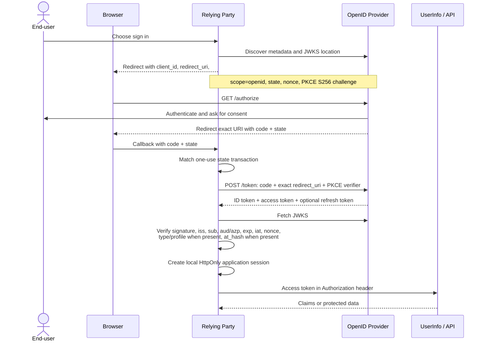

# 06 · OpenID Connect

> **TL;DR** — OpenID Connect (OIDC) is the identity layer on OAuth 2.0, not a
> competing protocol. Add `scope=openid` to an OAuth authorization request and
> the client can receive a signed ID token that says who authenticated, for
> which client, at which issuer, and until when. Use Authorization Code + PKCE,
> verify every ID-token invariant, then create a separate local application session.

## Why it was invented

OAuth 2.0 answers a delegation question: **may this client call that API with these
permissions?** It deliberately does not standardize how a client logs a person in.
An access token describes delegated API access, not an authentication event.
Treating arbitrary OAuth access tokens as login assertions produced incompatible and
unsafe conventions.

OpenID 1.0 (2005) and OpenID 2.0 (final in 2007) enabled decentralized web login,
but used their own browser messages and were difficult to combine with modern API
authorization. Facebook Connect and other provider-specific social-login APIs added
more incompatible profile formats, token rules, and endpoints. Every relying party
needed custom code.

The OpenID Foundation designed OpenID Connect on the OAuth 2.0, HTTP, JSON, JWT,
and JOSE stack. OIDC Core became final in 2014. It standardized discovery, identity
claims, signed ID tokens, UserInfo, subjects, authentication request controls, and
session/logout extensions while reusing OAuth's authorization endpoint and flows.

The compact definition is worth keeping exact:

> **OIDC = an identity layer on top of OAuth 2.0.**

OAuth can be used without OIDC. OIDC uses OAuth machinery and begins when the
request includes the `openid` scope.

## How it works

### Roles and the `openid` switch

| OIDC term | OAuth-shaped role | Job in this lab |
| --- | --- | --- |
| End-user | Resource owner | Alice authenticates and approves the request. |
| OpenID Provider (OP) | Authorization server | The small IdP authenticates Alice and issues tokens. |
| Relying Party (RP) | OAuth client | The application verifies the ID token and creates its own session. |
| Resource server | Protected API | UserInfo or the orders API accepts an access token, never an ID token. |
| User agent | Browser | Carries front-channel redirects and the short-lived code. |

A normal OAuth request can ask for `orders:read`. An OIDC request asks for
`openid orders:read`. `openid` changes the contract: a successful authorization-code
exchange includes an ID token. Other scopes select claims or API permissions; they do
not replace `openid`.

### Authorization Code + PKCE



The front channel exposes the authorization request and one-time code to the browser.
The token exchange is back-channel server-to-server HTTP. The code is bound to the
client, exact redirect URI, and PKCE challenge. The RP must consume its login
transaction once; the OP must consume the code once.

This chapter's demo keeps the browser steps visible in process. Discovery, the token
request, JWKS retrieval, and UserInfo are real HTTP calls to the small IdP on a random
localhost port. The registered redirect URI intentionally has no listener: it is a
string carried back to `finishLogin()`, which makes exact redirect matching easy to see.

### Three token-shaped objects with different audiences

| Object | Consumer | Meaning | Send it where? |
| --- | --- | --- | --- |
| ID token | One RP named by `aud` | Signed statement about one authentication | RP callback/backend only |
| Access token | Resource server named by `aud` | Delegated authority represented by scopes | `Authorization: Bearer` to that API |
| Refresh token | OP token endpoint | Credential for obtaining replacement tokens | Confidential back channel only |
| UserInfo response | RP | Current standard claims selected by access-token scopes | Returned by the OP's UserInfo endpoint |

An ID token is not an API credential. An API must reject it even when its signature is
genuine. An access token is not proof that the current browser just authenticated; it
may represent a client, another audience, old authorization, or no human at all.
UserInfo is an OAuth-protected OIDC endpoint: the RP calls it with an access token and
still uses `sub` as the identity key.

Refresh tokens are often opaque and long-lived relative to access tokens. Store them
server-side, rotate them on use, and revoke their family on detected reuse. The lab
implements family reuse detection with in-memory spent-token tombstones; production needs durable,
concurrent storage, atomic rotation and cleanup across instances.

### What is in an ID token

The ID token is a signed JWT in this lab. Decoding its JSON is not verification.

| Claim | Meaning and required check |
| --- | --- |
| `iss` | Issuer identifier. It must exactly equal the configured/discovered OP issuer. |
| `sub` | Required non-empty stable identifier for the end-user at that issuer. Key users by `(iss, sub)`. |
| `aud` | Intended RP client ID or IDs. The current RP must be included. |
| `exp` | Expiration. Reject after it, allowing only a small deliberate clock tolerance. |
| `iat` | Required numeric issue time. Reject wrong type/implausible values under the provider profile; it does not replace `exp`. |
| `auth_time` | When the OP authenticated the user. Required by some `max_age` and assurance uses. |
| `nonce` | RP's per-login value. It must match the transaction that started this login. |
| `azp` | Authorized party. When multiple audiences or the provider profile requires it, verify it names the expected client. |
| `acr` | Authentication Context Class Reference: the assurance/context class the OP says it met. Enforce only values the RP understands and trusts. |
| `amr` | Authentication Methods References, such as password or hardware-key methods. Do not invent assurance policy from unfamiliar values. |
| `at_hash` | Optional in Authorization Code Flow; if the OP includes it, verify that it matches the access token returned beside the ID token. |

The JOSE header matters too. Pin the allowed signing algorithm and select only a trusted
JWKS key by `kid`. OIDC does not require a `typ` header or Cognito-style `token_use` claim;
when a provider profile includes them, constrain them, but do not reject a conforming token merely
because either optional field is absent. Do not let
an untrusted `alg`, `jku`, `jwk`, or arbitrary key URL choose how trust works.

### Discovery and JWKS

The RP starts from a configured issuer and reads
`{issuer}/.well-known/openid-configuration`. Metadata advertises the authorization,
token, UserInfo, logout, and JWKS endpoints plus supported features. The returned
`issuer` must exactly match the configured issuer; otherwise an authorization-server
mix-up can bind an authorization response to the wrong token endpoint.

`jwks_uri` publishes public verification keys. Cache keys with bounded freshness,
refresh when a previously unknown `kid` appears, and retain old keys during rotation.
Never accept whichever key a token supplies. TLS and trusted issuer configuration are
part of the trust boundary.

### Public and pairwise subjects

OIDC defines subject identifier types:

- **Public subject:** one OP gives the same `sub` to a user across its RPs.
- **Pairwise subject:** the OP derives a different opaque `sub` for each sector of RPs,
  reducing cross-client correlation while staying stable inside that sector.

Use the tuple `(iss, sub)` as the external identity key. Never key accounts by email.
Email can change, be reassigned, differ in normalization, be unverified, or collide
across issuers. Even `email_verified=true` describes verification by that issuer; it
does not turn email into an immutable global identifier. Link accounts only through an
explicit, authenticated policy.

### `state`, `nonce`, and PKCE have different jobs

| Value | Generated and checked by | Exact job | It does **not** do |
| --- | --- | --- | --- |
| `state` | RP; matched at callback | Binds the browser callback to one local login transaction and resists login CSRF/callback mix-up | Prove who authenticated or bind the code to the token request |
| `nonce` | RP; copied by OP into ID token; checked by RP | Binds the verified ID token to the authorization request and resists replay/substitution | Protect the redirect URI or authorize API scopes |
| PKCE verifier/challenge | RP; challenge at authorization, verifier at token endpoint | Makes a stolen authorization code useless without the per-request verifier | Replace `state`, client authentication, or ID-token verification |

Use all three for Authorization Code login. PKCE is mandatory for public clients and is
recommended for confidential clients too. Store state, nonce, and the PKCE verifier in
a short-lived, one-use server-side transaction—not in a readable browser token.

### Authentication is not the RP session

The OP authenticates the end-user and issues an ID token. The RP verifies that token,
then normally creates its own application session and sends an opaque `Secure`,
`HttpOnly`, appropriately `SameSite` cookie. The ID token need not become the session
cookie. An OP SSO cookie and an RP session cookie have different owners, lifetimes,
revocation paths, and security policies.

Signing out of the OP does not automatically delete every RP session. Signing out of
one RP does not necessarily end the OP's SSO session. This is why “global logout” is a
distributed coordination problem rather than one cookie deletion.

### Authentication request controls

| Parameter | Purpose | Caution |
| --- | --- | --- |
| `prompt=none` | Ask the OP not to show UI; return an error if interaction is needed | Useful for session probing, but modern browser privacy limits iframe patterns |
| `prompt=login` | Ask for fresh user interaction | It is a request; apply RP policy to the returned authentication evidence |
| `prompt=consent` | Ask the OP to show consent | Provider policy still decides what is meaningful |
| `max_age` | Require authentication no older than a number of seconds | Verify `auth_time` in the returned ID token |
| `login_hint` | Suggest which account to show | A hint is not authenticated identity and may expose personal data in URLs/logs |
| `acr_values` | Request authentication context classes in preference order | Verify returned `acr`; do not assume unsupported values were honored |

### Claims and scopes

Standard scopes request claim groups: `profile` (for example `name`), `email`,
`address`, and `phone`; `openid` activates OIDC. `offline_access` requests refresh-token
access under OIDC consent rules. Providers may define custom scopes and claims such as
`groups`, but clients must not assume the same semantics across issuers. Ask only for
what the RP needs, and remember that a requested claim may still be absent.

This lab supports `profile`, `email`, and `groups`. It always issues a refresh token for
its registered authorization-code clients as a teaching simplification; production OPs
usually apply stricter policy and may require `offline_access`.

### Logout channels

- **RP-initiated logout:** the RP sends the browser to the OP's end-session endpoint,
  often with an ID-token hint and registered post-logout URI.
- **Front-channel logout:** the OP asks the browser to visit logout endpoints or frames
  for participating RPs. Browser tracking protections, blocked third-party cookies,
  dead tabs, and network failures make delivery unreliable.
- **Back-channel logout:** the OP sends signed logout tokens directly to RP backends.
  It avoids browser constraints but requires reachable endpoints, replay protection,
  session correlation, retries, and operational trust.

No channel can erase an offline token already copied elsewhere. RPs still need short
lifetimes, local session expiry, token revocation strategy, and explicit risk policy.
Global logout is hard because there is no atomic transaction across all applications,
browsers, devices, access tokens, refresh tokens, and upstream identity providers.

### OIDC, OAuth, and SAML

| | OAuth 2.0 | OpenID Connect | SAML 2.0 |
| --- | --- | --- | --- |
| Primary purpose | Delegate API access | Authenticate a user and convey identity on OAuth | Enterprise browser federation and attribute assertions |
| Main artifact | Access token | ID token, plus OAuth tokens | Signed XML assertion/response |
| Typical format | Opaque or JWT | JWT/JSON | XML |
| API authorization | Core use | Reuses OAuth access tokens | Not its primary model |
| Discovery/keys | Authorization-server metadata is separate | Standard OP discovery + JWKS | Exchanged XML metadata + certificates |
| Modern browser/mobile fit | Authorization framework | Strong fit with Code + PKCE | Common for established workforce SaaS integrations |

OIDC and SAML can federate the same organizations. A broker can accept SAML or OIDC
from an upstream identity provider and issue its own OIDC tokens downstream. That
changes issuer, subject namespace, signing keys, claims, and session boundaries; it is
not token forwarding. Chapter 07 follows that SSO and federation/broker relationship.

## Run it

From the repository root:

```bash
npm run 06
```

The demo starts the shared small IdP on an operating-system-assigned localhost port,
registers one confidential RP at runtime, and performs the complete flow. Look for:

1. real discovery metadata and its `jwks_uri`;
2. an authorization URL containing `scope=openid`, state, nonce, and an S256 PKCE
   challenge—but not the verifier;
3. login, consent, one-use code, real `/token`, and real JWKS calls;
4. abbreviated ID-token header/claims and omitted token values;
5. successful signature, issuer, audience, expiration, nonce, and `at_hash` checks;
6. a real UserInfo call and the same stable `sub`;
7. rejection of wrong state, wrong nonce, ID-token-at-API, and access-token-as-ID-token;
8. the RP's local session remaining after the separate IdP session is removed.

Run the focused tests:

```bash
npx vitest run chapters/06-oidc
```

The tests use only random localhost ports. Nothing calls an external identity provider.

## Scenarios

- **Customer and social sign-in:** web, mobile, and native applications use Code +
  PKCE with a managed OP. The RP verifies the ID token and keeps a local session.
- **Enterprise workforce SSO:** an OIDC RP trusts a workforce OP or a broker that
  federates an upstream SAML/OIDC directory. Provisioning and authorization remain
  separate concerns.
- **API plus profile:** the RP consumes the ID token for login, an access token for an
  API, and optionally UserInfo for scoped claims. Those consumers must remain distinct.
- **Native/CLI sign-in:** system-browser PKCE or the OAuth device authorization grant
  avoids collecting the user's password in the client. Device authorization is OAuth;
  requesting `openid` adds the OIDC identity result when supported.

### AWS mapping

| AWS service or pattern | OIDC role and boundary |
| --- | --- |
| Amazon Cognito user pools | A user pool exposes OIDC discovery, authorization/token/UserInfo endpoints and JWKS, and issues Cognito tokens as an OP. Hosted UI and managed login provide the browser experience. App clients define callback URLs, grants, scopes, and whether a secret is possible. |
| Cognito federation | Google, Apple, another OIDC provider, or a SAML IdP can be upstream. Cognito validates that upstream response, maps attributes, then issues **Cognito-issuer** tokens to the app. The app does not treat an upstream token as interchangeable with a Cognito token. |
| Amazon API Gateway | HTTP API JWT authorizers validate issuer/audience JWT access tokens; REST APIs also offer Cognito user-pool authorizers. Configure the API audience and authorization scopes. Do not send an ID token merely because its signature validates. |
| Application Load Balancer `authenticate-oidc` | The ALB acts as an OIDC client, redirects to an OP, manages its authentication session cookie, and forwards identity information to the target. The target must follow the ALB header-verification contract and still perform application authorization. |
| AWS IAM Identity Center | AWS CLI and SDK sign-in use its OIDC-based client registration/device or PKCE authorization APIs. An external workforce IdP commonly connects to IAM Identity Center with SAML for authentication and SCIM for provisioning. OIDC, SAML, and SCIM solve different legs. |
| Amazon EKS: IAM Roles for Service Accounts (IRSA) | The cluster publishes an OIDC issuer for Kubernetes service-account tokens; AWS STS trusts configured claims so workloads can assume IAM roles. Here EKS is the issuer and the subject is a workload, not a human login. |
| Amazon EKS: human OIDC authentication | A cluster can be configured to trust an external OIDC identity provider for human bearer-token authentication. This is a separate trust relationship from the cluster issuer used by IRSA; never mix their issuers, audiences, or subjects. |
| Amazon corporate federation | Federate is encountered publicly as a centralized corporate federation/sign-in boundary. Public information is insufficient to characterize every internal protocol or control, so do not assume every downstream Amazon integration is OIDC. |

For AWS IAM role federation, an OIDC ID token or web identity token is evaluated by a
specific trust policy and STS operation. That is not a general license to use the same
token at arbitrary AWS APIs. Issuer, audience, subject, and condition keys remain the
trust boundary.

## Pros and cons

**Pros**

- Reuses OAuth 2.0 flows while adding a precise, signed authentication result.
- JSON/JWT, discovery, and JWKS fit browser, native, CLI, and API-oriented systems.
- Separates OP authentication from RP sessions and resource-server authorization.
- Supports privacy-preserving pairwise subjects and explicit claim minimization.
- Enables interoperable assurance signals, session controls, and several logout models.

**Cons**

- Safe use requires coordinated OAuth, JOSE, redirect, browser, session, and key-rotation
  rules; decoding a JWT is easy, validating the entire context is not.
- Provider differences in claims, logout, consent, refresh policy, and assurance remain.
- Bearer tokens are valuable credentials; browser storage and exfiltration risks persist.
- Discovery and key rotation add remote trust and caching behavior.
- Global logout, account linking, deprovisioning, and downstream authorization are not
  solved by one successful ID-token verification.

## Alternatives

- **SAML 2.0:** choose it for established enterprise browser federation, especially when
  the workforce IdP and SaaS catalog already exchange SAML metadata. It is XML-heavy and
  not an OAuth API-authorization framework.
- **Kerberos:** choose it for managed-domain, workstation-to-internal-service SSO with
  KDCs, service principals, and mutual authentication. It is not a public web federation
  protocol.
- **Local credentials + sessions:** reasonable for a small isolated application that
  should not depend on an external OP. The application then owns password/MFA recovery,
  abuse controls, and identity lifecycle.
- **WebAuthn/passkeys:** a phishing-resistant authentication method, not an OIDC
  federation replacement. An OP can authenticate with a passkey and report suitable
  `amr`/`acr`; an application can also use passkeys directly.
- **OAuth 2.0 alone:** correct when a client only needs delegated API access and does not
  need a standardized authenticated identity.

## Pitfalls

- **Using an access token as login:** its audience and semantics belong to an API; it may
  not identify a human or a fresh authentication. Require and verify an ID token for OIDC
  login.
- **Accepting an ID token at an API:** a genuine signature is insufficient. Enforce the
  API audience, access-token profile/type, issuer, expiry, and scopes.
- **Omitting state:** enables login CSRF and callback transaction mix-up. Generate an
  unpredictable, one-use value and bind it to the initiating browser session.
- **Omitting nonce:** permits an old or substituted ID token to be attached to a new
  authorization response. Match it after cryptographic verification.
- **Omitting PKCE:** a stolen code may be redeemed by the thief. Use S256 and a fresh
  high-entropy verifier, including for confidential clients.
- **Checking `aud` but ignoring `azp`:** multi-audience tokens can name another authorized
  party. Apply OIDC's `azp` rules and provider profile, not a substring check.
- **Keying users by email:** account takeover or accidental merging follows reassignment,
  aliases, normalization differences, or issuer collision. Key by `(iss, sub)`.
- **Wildcard or prefix redirect matching:** an attacker-controlled path, subdomain, or
  query can receive the code. Register and compare exact URIs.
- **Discovery mix-up:** accepting metadata whose issuer differs from the configured
  issuer can send codes or credentials to the wrong authorization server. Pin and match
  issuer; bind each transaction to its metadata.
- **Trusting token headers:** accepting `alg=none`, algorithm confusion, attacker `jwk`,
  or arbitrary `jku` turns attacker input into trust configuration. Pin algorithms and
  keys from the trusted issuer's JWKS.
- **Tokens in `localStorage` or URLs:** XSS can read storage; URLs leak through history,
  logs, analytics, screenshots, and referrers. Prefer a backend-for-frontend with opaque
  HttpOnly cookies and keep bearer tokens server-side.
- **Long-lived tokens:** theft remains useful until expiry and offline JWT validation may
  not notice revocation. Keep access tokens short, rotate refresh tokens, and constrain
  scopes/audiences.
- **Implicit flow:** returning access or ID tokens through the browser front channel
  increases leakage and substitution risk and cannot give PKCE's code redemption
  binding. Use Authorization Code + PKCE for new applications.
- **Confusing logout layers:** deleting only the OP cookie, only the RP cookie, or only a
  refresh token leaves other sessions active. Define local, OP, upstream, and token
  revocation behavior explicitly.

## Further reading

Primary specifications first:

- [OpenID Connect Core 1.0](https://openid.net/specs/openid-connect-core-1_0.html)
- [OpenID Connect Discovery 1.0](https://openid.net/specs/openid-connect-discovery-1_0.html)
- [OpenID Connect Session Management 1.0](https://openid.net/specs/openid-connect-session-1_0.html)
- [OpenID Connect RP-Initiated Logout 1.0](https://openid.net/specs/openid-connect-rpinitiated-1_0.html)
- [OpenID Connect Front-Channel Logout 1.0](https://openid.net/specs/openid-connect-frontchannel-1_0.html)
- [OpenID Connect Back-Channel Logout 1.0](https://openid.net/specs/openid-connect-backchannel-1_0.html)
- [RFC 6749 — OAuth 2.0](https://www.rfc-editor.org/rfc/rfc6749)
- [RFC 7636 — PKCE](https://www.rfc-editor.org/rfc/rfc7636)
- [RFC 8414 — Authorization Server Metadata](https://www.rfc-editor.org/rfc/rfc8414)
- [RFC 9068 — JWT Profile for OAuth 2.0 Access Tokens](https://www.rfc-editor.org/rfc/rfc9068)
- [RFC 9700 — OAuth 2.0 Security Best Current Practice](https://www.rfc-editor.org/rfc/rfc9700)
- [OAuth 2.0 for Browser-Based Applications](https://datatracker.ietf.org/doc/draft-ietf-oauth-browser-based-apps/)
