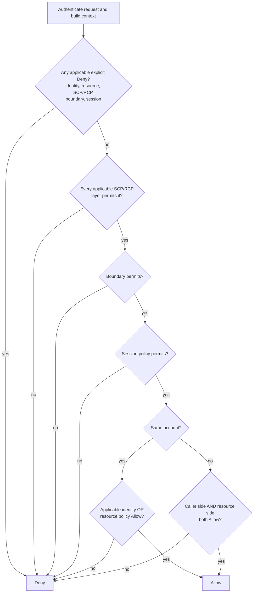

# 10 · AWS identity: IAM, STS, federation, and IAM Identity Center

> **TL;DR** — IAM answers whether an AWS principal may perform an AWS action on a resource.
>Humans should normally enter through IAM Identity Center/federation and assume roles; workloads
>should receive roles from their compute environment; neither should carry long-lived IAM access
>keys. STS produces temporary `accessKeyId + secretAccessKey + sessionToken` credentials, used to
>sign AWS API requests with SigV4. A role has two separate gates: its **trust policy** says who may
>assume it; its permissions say what the resulting session may do. The runnable lab simulates
>identity/resource policies, explicit deny, SCPs, boundaries, session policies and ABAC. The CDK
>example lets one GitHub repository obtain a nearly permissionless role through OIDC—no AWS secret
>stored in GitHub—and is synthesized/tested offline unless you explicitly deploy it.

## Why it was invented

An AWS account contains resources owned by one security boundary. The first AWS APIs used access
keys belonging to the account. As teams, services and partner accounts grew, one shared key could
not answer:

- Who made this request: a person, EC2 instance, Lambda, GitHub workflow, customer or partner?
- What exact actions may that identity perform on which resources and under which conditions?
- How can access expire without rotating one global secret?
- How can an external organisation vouch for a user without copying that user into every account?
- How can central security place a maximum boundary around delegated account administrators?

AWS Identity and Access Management (IAM, 2010) added users, groups, roles and policy documents.
AWS Security Token Service (STS) added role sessions with temporary credentials. Federation lets
SAML/OIDC identity providers exchange signed identity evidence for those sessions. AWS
Organizations adds account/OU guardrails. IAM Identity Center adds workforce directory/federation,
application/account assignments, access portal and permission sets over many accounts.

The key architectural move is **temporary role sessions instead of permanent identities and
keys everywhere**. Authentication proves a principal/session; IAM authorization evaluates the
request against policy every time.

## How it works

### The identity choices

| Identity mechanism | Who it is for | How it starts | What calls AWS APIs | Default choice? |
| --- | --- | --- | --- | --- |
| Root user | account owner/recovery-only operations | root credentials + MFA | root session | never daily use; protect and monitor |
| IAM user | legacy/direct identity in one account | password and/or long-lived access key | IAM-user credentials or `GetSessionToken` | avoid for workforce/workloads |
| IAM role | workload, federated human, partner account | trusted principal calls an STS assume operation, or AWS service supplies it | temporary role-session credentials | yes |
| IAM Identity Center user/assignment | workforce across accounts/apps | built-in directory, AD, or external IdP; portal/CLI login | generated `AWSReservedSSO_*` role session in target account | yes for workforce |
| Cognito user/identity pool | application customer | customer authentication + optional identity brokerage | app JWT to API, or identity-pool temporary role credentials | yes for customer identity, not employees |

An IAM **group** is only a way to attach identity policies to IAM users. It is not a principal,
cannot be named in a resource policy and cannot be assumed. An Identity Center group is a
workforce assignment/lifecycle object. Same word, different system.

### Request authentication: credentials and SigV4

Most AWS API calls carry Signature Version 4:

1. Canonicalize method, path, query, selected headers and payload hash.
2. Derive a signing key from the secret access key, date, Region and service.
3. HMAC the string-to-sign; send `Authorization`, date, payload hash and, for temporary sessions,
   `X-Amz-Security-Token`.
4. AWS resolves the access-key ID to a principal/session, verifies signature and token expiry,
   then runs authorization policy evaluation.

Temporary credentials are a triple:

| Field | Purpose | Secret? |
| --- | --- | --- |
| access key ID | identifies the role session/key | not a password, but avoid needless exposure |
| secret access key | signs requests | yes; never log/store in source |
| session token | proves this is the issued temporary session | yes; required with every request |
| expiration | hard session end | no |

A role ARN is not a credential. A trust policy is not permission. A permission policy is not a
way to assume the role. Keep those gates separate.

### Roles and STS

A role has no permanent credentials. A successful assumption creates an ARN such as:

```text
role:     arn:aws:iam::111122223333:role/DeployReadOnly
session:  arn:aws:sts::111122223333:assumed-role/DeployReadOnly/alice
```

Common exchanges:

| Operation/path | Input identity proof | Typical use |
| --- | --- | --- |
| `AssumeRole` | existing AWS SigV4 principal allowed by trust policy | account-to-account, service role chaining, brokered workforce |
| `AssumeRoleWithSAML` | signed SAML assertion for AWS | enterprise IdP → console/API role session |
| `AssumeRoleWithWebIdentity` | OIDC/JWT web-identity token | GitHub Actions, EKS IRSA, mobile/web federation |
| service role delivery | AWS service control plane | EC2 instance profile, Lambda execution role, ECS task role |
| EKS Pod Identity | EKS Pod Identity agent/service exchange | per-service-account pod credentials without per-cluster IAM OIDC provider |
| `GetSessionToken` | IAM-user credentials, optionally MFA | temporary session for a legacy IAM user; does not become a role |
| IAM Roles Anywhere | X.509 certificate trusted by configured CA/profile | workloads outside AWS obtain temporary credentials |

**External ID** addresses the cross-account confused-deputy problem. If a SaaS provider assumes
roles for many customers, each customer trust policy should require a provider-assigned,
customer-specific `sts:ExternalId`. An attacker who knows the SaaS AWS account but not the
victim's external ID cannot trick the SaaS into using the victim role. External ID is not a user
password and role ARN/external ID may be visible; the SaaS must bind it to the right tenant.

Session tags and source identity carry attribution/ABAC context into the role session. Trust
policy decides which callers may set/transit tags. Letting callers choose `department=finance`
without that guard is privilege escalation.

### IAM policy types

| Policy/control | Attached to | Grants? | Role in evaluation |
| --- | --- | --- | --- |
| Identity-based policy | user/group/role | yes | actions/resources the principal may request |
| Resource-based policy | bucket, queue, key, role trust, etc. | yes, to named Principal | resource owner opens access; service-specific semantics apply |
| Role trust policy | IAM role (a resource policy) | yes, only assume action | who may create a session of this role |
| Permissions boundary | user/role | **no** | maximum identity-based permission delegated admins may grant |
| Session policy | STS session request | **no** | narrows this one session; cannot expand role |
| Service Control Policy (SCP) | Organizations root/OU/account | **no** | maximum for principals in member accounts; management account and some exceptions differ |
| Resource Control Policy (RCP) | Organizations resources/accounts | **no** | maximum on supported resources regardless of resource policy; complements SCPs |
| VPC endpoint policy | endpoint | **no** | additional gate for requests traversing that endpoint |
| ACL / service guardrail | resource/service | service-specific | S3 ACL/BPA, KMS key policy, Lake Formation, etc. can add rules |

A permissions boundary or SCP saying `Allow s3:*` does not grant S3. It says another applicable
policy may grant up to that ceiling.

### Evaluation: union, intersection, explicit deny

A useful simplified flow (the runnable evaluator follows it, with documented omissions):



Rules worth memorizing:

1. Default is implicit deny.
2. A matching explicit `Deny` wins over every `Allow`, including administrator policies.
3. In a normal same-account request, identity and resource `Allow`s form a union.
4. Cross-account access needs permission on **both** sides: caller identity side and resource
   owner policy/trust side.
5. Boundary/SCP/session policies intersect with grants; each cap must permit the action.
6. Conditions use request context. Missing keys matter: `Bool` on missing
   `aws:MultiFactorAuthPresent` is false, while a Deny with `BoolIfExists=false` also catches
   long-term keys where the context key is absent.

Real IAM has important resource-principal exceptions. A resource policy naming an IAM user ARN,
a role ARN, or a specific assumed-role **session ARN** interacts differently with identity
implicit denies, boundaries and session policies. KMS also requires key-policy participation;
S3 Block Public Access can reject a policy; Organizations RCPs and service-linked roles add
rules. Use this simulator to learn the shape, then use IAM documentation, Access Analyzer and the
Policy Simulator for real decisions.

### RBAC and ABAC in IAM

- **RBAC:** assume a role such as `BillingReadOnly` or receive an Identity Center permission set.
  Policies attach to the role. Simple and auditable, but role count grows with team × environment.
- **ABAC:** one policy compares principal/session tags with resource tags, for example
  `${aws:PrincipalTag/dept}` against `aws:ResourceTag/dept`. Scales across resources, but tag
  creation/edit permissions become the authorization control plane.

Policy variables require policy `Version: "2012-10-17"`. A missing tag normally makes an Allow
not match (implicit deny), but test it. Deny unauthorized tag mutation with SCP/IAM conditions,
control which session tags federated callers may assert, and use `aws:TagKeys`/request-tag
conditions where applicable.

### IAM Identity Center: the workforce layer

IAM alone can model users/roles/policies in one account; it does not provide a complete modern
multi-account workforce experience. Identity Center adds:

- identity source: built-in directory, AWS Managed Microsoft AD / AD Connector, or external IdP;
- users/groups and application/AWS-account assignments;
- **permission sets**, provisioned as IAM roles in target accounts;
- access portal and CLI/SDK login;
- session/MFA policy and central audit/lifecycle integrations.

With an external IdP, SAML usually carries browser authentication and SCIM provisions/deactivates
users/groups. SAML is not provisioning; SCIM is not authentication. Permission sets remain AWS
side and become roles named like `AWSReservedSSO_<PermissionSet>_<suffix>`.

`aws sso login` (legacy CLI command name) registers/uses an OIDC client and runs browser PKCE or
Device Authorization. Identity Center tokens then obtain short-lived account/permission-set role
credentials. The CLI cache is sensitive; it replaces long-lived access keys, not the need to
protect the workstation.

### GitHub Actions OIDC: the deployable example

A GitHub-hosted job can request a short-lived JWT with:

```text
iss = https://token.actions.githubusercontent.com
aud = sts.amazonaws.com
sub = repo:OWNER/REPO:ref:refs/heads/main
```

The CDK stack creates/imports an IAM OIDC provider and a role trust policy requiring all three
facts:

```json
{
  "Principal": { "Federated": "arn:aws:iam::<account>:oidc-provider/token.actions.githubusercontent.com" },
  "Action": "sts:AssumeRoleWithWebIdentity",
  "Condition": {
    "StringEquals": { "token.actions.githubusercontent.com:aud": "sts.amazonaws.com" },
    "StringLike": { "token.actions.githubusercontent.com:sub": "repo:OWNER/REPO:ref:refs/heads/main" }
  }
}
```

STS fetches GitHub's JWKS, verifies signature/issuer/audience/time, checks trust conditions and
returns temporary role credentials. No AWS secret exists in repository settings. The role in
this lab grants only `iam:GetRole` on itself; `GetCallerIdentity` needs no Allow.

GitHub `sub` varies by context:

| Workflow context | Typical subject suffix |
| --- | --- |
| branch | `repo:o/r:ref:refs/heads/main` |
| tag | `repo:o/r:ref:refs/tags/v1.2.3` |
| pull request (no environment) | `repo:o/r:pull_request` |
| environment | `repo:o/r:environment:production` |

The stack defaults to `repo:o/r:ref:refs/heads/main`. Repository-wide `repo:o/r:*` trust requires
an explicit `trustAllRepoSubjects=true` context opt-in because it includes every branch, tag, PR
and environment. Prefer a protected branch or adapt the stack to a protected GitHub environment
subject before adding meaningful permissions.
Repository rename/transfer changes the subject. Forks must pass their own `owner/repo`.

The workflow asks only for `id-token: write`, decodes one diagnostic token payload (decoding is
not verification), then a SHA-pinned official action requests/exchanges its own token. Authority
comes from STS verification, not from printed claims.

## Run it

### Offline: safe, no AWS credentials or calls

From the repository root:

```bash
npx tsx chapters/10-aws-iam-and-federation/src/demo.ts
npx vitest run chapters/10-aws-iam-and-federation
npx tsc

cd chapters/10-aws-iam-and-federation
npx cdk synth --quiet
```

The demo narrates:

1. identity Allow and implicit deny;
2. explicit Deny beating AdministratorAccess;
3. an SCP Region guardrail and why every Organizations level needs an Allow;
4. permissions-boundary and session-policy intersections;
5. same/cross-account resource policy requirements;
6. department-tag ABAC;
7. `Bool` vs `BoolIfExists` for missing MFA context.

Code map:

| File | Purpose |
| --- | --- |
| `src/iam-eval.ts` | offline IAM policy-language/evaluation subset with trace |
| `src/scenarios.ts` | policies/principals/resources for the narrated cases |
| `src/demo.ts` | readable evaluation traces |
| `src/*.test.ts` | evaluator, scenarios and synthesized stack assertions |
| `lib/github-oidc-stack.ts` | OIDC provider + tightly trusted, nearly permissionless role |
| `bin/app.ts`, `cdk.json` | chapter-local CDK app |
| `../../.github/workflows/aws-oidc-demo.yml` | live manual GitHub OIDC proof |

### Optional live lab: explicit AWS/GitHub changes

This creates IAM resources in whichever account your credentials select. Treat an unknown
account as production. Use a dedicated sandbox/learning account, inspect identity first, and do
not run this against production:

```bash
aws sts get-caller-identity
aws configure get region

cd chapters/10-aws-iam-and-federation
npx cdk bootstrap   # only if that sandbox account/Region is not bootstrapped
npx cdk deploy \
  -c githubRepo=YOUR-OWNER/identity-security-lab \
  -c githubRef=refs/heads/main
```

If the account already has the GitHub provider (only one provider per issuer URL), import it:

```bash
npx cdk deploy \
  -c githubRepo=YOUR-OWNER/identity-security-lab \
  -c githubRef=refs/heads/main \
  -c githubProviderArn=arn:aws:iam::123456789012:oidc-provider/token.actions.githubusercontent.com
```

Then:

1. Copy stack output `RoleArn` into GitHub repository **variable** `AWS_OIDC_ROLE_ARN` (not a
   secret; role ARNs are public identifiers).
2. Run workflow **aws-oidc-demo** manually from the trusted main ref.
3. Inspect printed `iss`, `sub`, `aud`, repository/ref/expiry; then the assumed-role ARN.
4. Confirm `iam:GetRole` succeeds and `s3:ListAllMyBuckets` specifically returns AccessDenied.
5. Remove the repository variable, then destroy the stack:

```bash
npx cdk destroy \
  -c githubRepo=YOUR-OWNER/identity-security-lab \
  -c githubRef=refs/heads/main
```

Destroying an OIDC provider used by other roles breaks their federation. If you imported a
provider, CDK does not own/delete it. If this stack created one but other roles later started
using it, remove/rehome those trusts before deletion. The fixed lab role name can also collide
with an existing role; inspect before deploy.

### Simulator limitations

The evaluator is deliberately educational, not a drop-in authorization engine:

| Modeled | Omitted/simplified |
| --- | --- |
| Allow/Deny, Action/NotAction, Resource/NotResource, Principal subset | `NotPrincipal`, service/federated/canonical principals, anonymous requests |
| String/Arn/Bool/Null/basic numeric conditions | IP/date/binary, set operators and multi-valued context |
| identity/resource policies, boundaries, SCP levels, session policy | RCPs, endpoint policies, ACLs, service-specific control planes |
| same/cross-account union/intersection | user vs role vs role-session resource-principal exceptions and account-principal delegation |
| IAM/STS commercial-style ARNs | all partition/path/service nuances, action-resource compatibility |
| tag variables and missing-key behavior | policy grammar validation and every service condition key |

It also does not model KMS key-policy requirements, S3 Block Public Access, service-linked-role/SCP
exceptions, management-account SCP behavior, or `GetCallerIdentity`'s special response behavior.
It now prevents supplied context from overwriting derived principal/resource accounts/ARN/tags.
Use Access Analyzer policy validation/custom checks and IAM Policy Simulator against non-production
fixtures; test denial paths at the service too.

## Scenarios

**Workforce across 100 accounts.** Identity Center groups receive permission sets. The user logs
in once with the workforce IdP/MFA and selects an account/role. No IAM user replicated 100 times.

**AWS workload.** Lambda execution role, ECS task role, EC2 instance profile, EKS Pod Identity or
IRSA. SDK credential chain rotates temporary credentials. Never bake keys into image/env files.

**External CI.** GitHub Actions OIDC as above. Other CI providers use their issuer/subject claim
model. Pin organisation/project/repository/branch/environment and audience, not only issuer.

**Third-party SaaS.** Cross-account `AssumeRole`, exact provider AWS account/role principal plus
customer-specific ExternalId and least permissions. Do not give the vendor an IAM-user key.

**On-premises workload.** IAM Roles Anywhere with private PKI certificate, or an OIDC/SAML broker,
rather than long-lived access keys. Compare operational PKI/broker costs.

**Customer/mobile app.** Cognito User Pool authenticates; API uses JWT. Only add Identity Pool if
the untrusted client truly needs narrow direct AWS access (chapter 11). Identity Center is for
workforce, Cognito for app customers.

Amazon employees may encounter brokers such as Isengard or Conduit that provide federated,
temporary access to AWS accounts. At public-knowledge level, the lesson is the same: workforce
identity is exchanged for a bounded role session. This chapter makes no claim about private
implementation or policy.

## Pros and cons

**Pros**

- Policy is evaluated per AWS request and supports action, resource, principal and rich context.
- Roles/STS eliminate permanent credentials from workloads and federated sessions.
- Federation keeps workforce/customer lifecycle at the identity source.
- SCPs/RCPs/boundaries let central teams cap delegated administration without manually granting.
- Resource policies and role trust express cross-account access without sharing secrets.
- Identity Center centralizes multi-account workforce assignments and CLI/portal experience.
- CloudTrail attributes actions to role session/source identity when names/tags are governed.

**Cons**

- Policy evaluation is powerful and nontrivial; service-specific exceptions matter.
- Multiple policy layers make “why denied?” or “why allowed?” hard without traces/Access Analyzer.
- A broad trust condition creates credentials even if permissions are currently tiny; future policy
  expansion can turn latent trust into compromise.
- Federation/Identity Center are critical availability and signing/lifecycle dependencies.
- ABAC shifts security to tag governance and session-tag trust.
- Temporary credentials can still be stolen and used until expiration.
- Organizations guardrails and Identity Center provisioning introduce control-plane propagation and
  operational dependencies.

## Alternatives

| Need | Alternative | Pick it when |
| --- | --- | --- |
| workforce AWS access | IAM Identity Center | default; use IAM users only for exceptional legacy/break-glass cases |
| AWS workload on AWS | compute/task/pod role | default; SDK auto-refreshes temporary credentials |
| external workload | Roles Anywhere, OIDC federation, cross-account role | choose according to existing PKI/issuer/account boundary |
| customer authentication | Cognito user pool / external OIDC IdP | IAM users and Identity Center are not customer directories |
| narrow browser/mobile AWS call | API backend/presigned URL instead of identity pool | business validation or smaller exposure is preferable |
| policy authoring for application objects | Cedar/Verified Permissions, OPA, Zanzibar-style engine | IAM controls AWS APIs; app-level resource authorization is chapter 12 |
| secret-vended CI | OIDC workload federation | almost always; static access keys only where no federation path exists, with rotation/monitoring |
| custom multi-account broker | Identity Center / Organizations-managed roles | avoid maintaining credential-vending logic when managed assignment fits |

## Pitfalls

| Mistake | Attack / failure | Fix |
| --- | --- | --- |
| root or IAM-user key used daily | long-lived account compromise; poor attribution/rotation | MFA root, no root keys, Identity Center/roles, credential report and detection |
| AWS keys in GitHub/CI secrets | repository/action/runner compromise gains durable AWS access | OIDC with exact issuer/aud/sub and short role session |
| OIDC trust has no `sub` | every repository/tenant at issuer may assume role | exact repo/project/workload subject condition |
| OIDC trust has no `aud` | token minted for another relying party is substituted | exact STS/custom audience condition |
| `repo:org/*` or `repo:o/r:*` for deploy role | compromised repo/branch/PR obtains production credentials | protected branch/environment subject; GitHub environment approvals; split roles |
| movable third-party action tag | upstream tag compromise silently changes code with ID-token permission | pin full commit SHA; review automated updates |
| role trust confused with permissions | unwanted principal can enter, or intended principal cannot do anything | review both gates separately and test resulting session |
| whole-account/root Principal assumed to mean one role | account admins may delegate/use access more broadly than intended | exact role/principal plus conditions; understand account-principal delegation |
| cross-account only resource Allow | caller still denied, or trust misunderstood | explicit caller identity Allow **and** resource-side Allow/trust |
| boundary assumed to grant | role remains implicit denied | identity policy grants; boundary only caps |
| SCP Allow assumed to grant | account principal still denied | SCP is maximum; identity/resource policies grant |
| `iam:PassRole` broad | user creates/updates service to run a stronger role | restrict passed role ARNs and `iam:PassedToService`; control role creation |
| user controls ABAC tags | self-assigns privileged department/environment | protect tag mutation and trusted session-tag claims centrally |
| `Bool` Deny for absent MFA key | long-term access keys bypass because key is absent, not false | `BoolIfExists` pattern, or eliminate long-term human keys |
| no ExternalId for vendor role | confused deputy uses provider to access another customer | unique vendor-managed ExternalId bound to tenant |
| session name/source identity ungoverned | misleading CloudTrail attribution | validate pattern, require source identity/tags, map stable workforce ID |
| broad `*` “temporarily” | copied policy becomes permanent and exploitable | smallest actions/resources/conditions; review with Access Analyzer; expiry ticket |
| simulator treated as AWS | false allow/deny because service/principal exceptions omitted | official docs/tools + sandbox integration tests |

## Further reading

Primary AWS documentation:

- IAM policy evaluation logic: https://docs.aws.amazon.com/IAM/latest/UserGuide/reference_policies_evaluation-logic.html
- Resource-based policy principal semantics: https://docs.aws.amazon.com/IAM/latest/UserGuide/reference_policies_evaluation-logic_policy-eval-denyallow.html
- IAM best practices: https://docs.aws.amazon.com/IAM/latest/UserGuide/best-practices.html
- Roles and temporary credentials: https://docs.aws.amazon.com/IAM/latest/UserGuide/id_roles.html
- STS `AssumeRole`, `AssumeRoleWithSAML`, `AssumeRoleWithWebIdentity`: https://docs.aws.amazon.com/STS/latest/APIReference/
- External IDs and confused deputy: https://docs.aws.amazon.com/IAM/latest/UserGuide/confused-deputy.html
- IAM Identity Center: https://docs.aws.amazon.com/singlesignon/latest/userguide/what-is.html
- Identity Center CLI configuration: https://docs.aws.amazon.com/cli/latest/userguide/cli-configure-sso.html
- Organizations SCPs and RCPs: https://docs.aws.amazon.com/organizations/latest/userguide/orgs_manage_policies.html
- IAM Access Analyzer policy validation: https://docs.aws.amazon.com/IAM/latest/UserGuide/access-analyzer-policy-validation.html
- GitHub OIDC in AWS: https://docs.github.com/actions/security-for-github-actions/security-hardening-your-deployments/configuring-openid-connect-in-amazon-web-services
- GitHub OIDC subject claims: https://docs.github.com/actions/concepts/security/openid-connect
- AWS Security Blog, GitHub Actions OIDC federation: https://aws.amazon.com/blogs/security/use-iam-roles-to-connect-github-actions-to-actions-in-aws/
- AWS CDK `OidcProviderNative`: https://docs.aws.amazon.com/cdk/api/v2/docs/aws-cdk-lib.aws_iam.OidcProviderNative.html
- SigV4: https://docs.aws.amazon.com/IAM/latest/UserGuide/reference_sigv.html

Protocol references:

- SAML 2.0 Core/Profiles: https://docs.oasis-open.org/security/saml/v2.0/
- OpenID Connect Core: https://openid.net/specs/openid-connect-core-1_0.html
- RFC 8628, OAuth Device Authorization: https://www.rfc-editor.org/rfc/rfc8628
- RFC 8693, OAuth Token Exchange: https://www.rfc-editor.org/rfc/rfc8693
