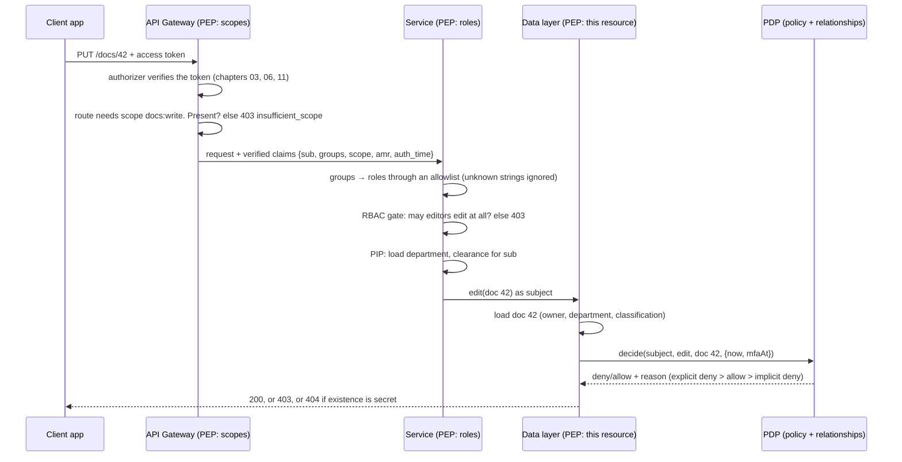

# 12 · Authorization: who may do what

> **TL;DR** — Authentication answers "who is this?" and every previous chapter ends there, with a
> set of verified claims: `{ sub, groups, scope, amr, auth_time }`. Authorization answers "and what
> may they do to *this* thing, now?". Three models cover almost every system: **RBAC** (roles →
> permissions: cheap, coarse, cannot say "only your own documents"), **ABAC** (rules over attributes
> of subject, action, resource and environment: precise, needs correct attributes at decision time)
> and **ReBAC** (a graph of relationships, Zanzibar style: the model behind every "share with…"
> button, and the only one where "who can see this?" is a natural query). Evaluate like IAM does:
> explicit deny > explicit allow > implicit deny. Check scopes at the edge, roles in the service,
> the resource in the data layer, and never only in the browser. The number one API vulnerability
> is still a missing check on the detail endpoint (BOLA / IDOR).

## Why it was invented

### The line between authentication and authorization

Authentication establishes an identity. Authorization takes that identity plus a request and
says yes or no. Mixing the two is where most confusion, and most bugs, start:

| Question | Layer | HTTP answer when it fails | Why |
|---|---|---|---|
| Who are you? Prove it. | Authentication (chapters 01 to 11) | `401 Unauthorized` with `WWW-Authenticate` | The name is historical; it means "unauthenticated". The response must say how to authenticate (RFC 9110 section 15.5.2) |
| I know who you are. May you do this? | Authorization (this chapter) | `403 Forbidden` | Re-authenticating will not help. Say so. RFC 6750 adds `error="insufficient_scope"` when the missing piece is an OAuth scope |
| May you even know this exists? | Authorization, for objects you enumerate by id | `404 Not Found` | RFC 9110 section 15.5.4 allows 404 in place of 403 to hide that a resource exists. GitHub does it for private repositories. Use it when ids are guessable and existence is itself information (patient numbers, invoice ids, user ids) |

The rule: 401 is for "no usable identity", 403 for "identity yes, permission no", and 404 when
the fact that a `403` would be the honest answer is already a leak. Be consistent: if your list
endpoint hides an object and your detail endpoint returns 403 for it, you have built an oracle.

### A short history

Every model here was invented to fix a limit of the one before it:

| Year | Milestone | The pain it addressed |
|---|---|---|
| 1965–1975 | Access control lists in Multics; the Unix mode bits (`rwxr-xr--`, owner / group / other) | Time-sharing: several people, one machine. Per-file lists of who may read, write, execute. Discretionary: the owner decides |
| 1973 | Bell–LaPadula (MITRE, for the US Department of Defense): mandatory access control, "no read up, no write down" | Owners cannot be trusted to keep secrets secret. Labels (classification, clearance) are set by the organisation and the owner cannot override them. The `restricted-needs-clearance` rule in this chapter is exactly this idea |
| 1983 | TCSEC ("Orange Book") formalises DAC and MAC | Vocabulary and evaluation levels for the two families |
| 1992 | Ferraiolo and Kuhn, *Role-Based Access Controls* (15th National Computer Security Conference) | ACLs per file per user did not scale to companies. Group permissions by job function, assign functions to people. Sandhu et al. (1996) add the RBAC0–RBAC3 family: flat, hierarchical, constrained |
| 2003 | XACML 1.0 (OASIS), the first ABAC standard | Policy as data, not code, evaluated by a decision point. Its architecture vocabulary (PEP, PDP, PAP, PIP) is still how people describe authorization systems |
| 2004 | ANSI INCITS 359-2004: the NIST RBAC standard | One agreed definition of core, hierarchical and constrained RBAC |
| 2014 | NIST SP 800-162, *Guide to Attribute Based Access Control* | Roles had exploded ("editor-eng-restricted-emea"). Decide on attributes of subject, object, action and environment instead |
| 2016 | Open Policy Agent and its language Rego | A general-purpose policy engine you run next to your service (sidecar, library), decoupling policy from code for Kubernetes, gateways and applications |
| 2019 | Google, *Zanzibar: Google's Consistent, Global Authorization System* (USENIX ATC) | Drive, YouTube, Calendar: billions of objects shared with people and groups, nested. Model access as relationship tuples, check by walking the graph, answer "who can see this?" as well as "can she?" |
| 2023 | Cedar (open source, May) and Amazon Verified Permissions (GA, June) | A policy language designed to be analysable (you can prove two policies are equivalent, or that no policy grants X) with `permit` / `forbid` and forbid-wins semantics, offered as a managed decision point for your own applications |

## How it works

### Vocabulary (from XACML, still the best we have)

| Term | Meaning | In this chapter |
|---|---|---|
| Subject / principal | Who is asking. Identity plus attributes | `User { id, roles, department, clearance }`, built from `sub`, groups and a directory lookup |
| Action | What they want to do | `view`, `edit`, `share`, `delete` |
| Resource / object | The thing it would happen to, with its attributes | `Document { id, owner, department, classification }` |
| Environment / context | Facts about the request, not the parties: time, MFA, network | `{ now, mfaAt }` from `auth_time` and `amr` |
| PEP, Policy Enforcement Point | The code that asks the question and obeys the answer | The gateway route, the service middleware, the repository method |
| PDP, Policy Decision Point | The code that evaluates the policy | `rbacAllows`, `abacAllows`, `rebacAllows`; IAM; Verified Permissions; OPA |
| PAP, Policy Administration Point | Where policy is written and changed | `POLICY` in `models.ts`; the IAM console; the Verified Permissions policy store |
| PIP, Policy Information Point | Where attributes the request did not carry are fetched | `lookupUser(sub)` in `scenario.ts`: department and clearance live in HR's directory, not in the token |

The whole chapter, as a request flow:



Every layer narrows. Passing one buys the right to be evaluated by the next, nothing more.

### The three models

The domain is the same for all three, so the differences are the models', not the example's.
Everything is in `src/models.ts`.

**RBAC: roles → permissions.** A role is a named set of permissions; users hold roles.
Hierarchical RBAC lets a role inherit another's permissions, here admin ⊇ editor ⊇ viewer:

| Role | Adds | Full permission set |
|---|---|---|
| viewer | view | view |
| editor | edit, share | view, edit, share |
| admin | delete | view, edit, share, delete |

`rbacAllows(user, action)` has no resource parameter. That is the model, not a shortcut: RBAC
answers "can editors edit?" and has no words for "only your own" or "only your department".
Faced with that requirement teams either multiply roles (`editor-eng`, `editor-finance`,
`editor-doc-42`, the role explosion NIST 800-162 was written against) or add a second check after
the role check. That second check is ABAC or ReBAC.

**ABAC: rules over attributes.** A policy is a list of rules; each rule is an effect (allow or
deny) and a predicate over subject, action, resource and environment. Roles are just one more
subject attribute (`admins-manage-all-documents`), so ABAC contains RBAC. The policy of this
chapter:

| Rule | Effect | Reads as |
|---|---|---|
| `owner-controls-own-documents` | allow | the owner may view, edit and share (delete is an admin operation) |
| `department-may-view` | allow | anyone may view the documents of their own department |
| `admins-manage-all-documents` | allow | admins may do anything to any document |
| `restricted-needs-clearance` | deny | restricted documents need high clearance, whoever you are: owner and admin included (Bell–LaPadula's "no read up") |
| `delete-needs-fresh-mfa` | deny | delete needs MFA within the last 15 minutes (step-up authentication as a rule, not a special case) |

Evaluation is IAM's: every rule runs, then **explicit deny > explicit allow > implicit deny**.
Three consequences worth internalising:

- Silence is a no. If no rule allows, the answer is deny. New actions and new resource types
  fail closed until someone writes a rule.
- Adding an allow rule can never weaken a deny rule. Deny rules are guardrails; allow rules are
  grants. They can be owned by different people (security writes guardrails, product writes grants).
- The decision does not depend on rule order, so the policy can be split across files, teams
  and services without changing its meaning. The tests shuffle the rules to prove it.

The cost of ABAC is attributes: every one must be correct, current and available at decision
time. Department comes from HR. Clearance comes from security. Classification comes from the
document. MFA freshness comes from the token. If any of them is stale, the decision is wrong, and
the reverse question ("who can view this?") means evaluating the policy once per user.

**ReBAC: relationships.** Everything is a tuple `object#relation@subject`, Zanzibar's notation:

```
doc:42#owner@user:alice                     alice owns document 42
doc:42#parent@folder:roadmaps               document 42 is in folder "roadmaps"
group:eng#member@user:bob                   bob is in group eng
folder:roadmaps#editor@group:eng#member     every member of eng is an editor of the folder
```

The last subject is a *userset*: not one user but "whoever has `member` on `group:eng`",
resolved at check time. A schema (Zanzibar's namespace configuration) says how relations derive
from each other: on documents and folders `owner ⊆ editor ⊆ viewer`, and editor / viewer of a
document inherit from its parent folder. `rebacAllows(store, user, relation, object)` is a
depth-first search from `object#relation` towards the user across direct tuples, usersets,
included relations and parents; it returns the path it found, so every allow is explainable:

```
doc:42#parent@folder:roadmaps → folder:roadmaps#editor@group:eng#member → group:eng#member@user:bob
```

Nothing about bob or the document changed when alice shared the folder. One tuple appeared, and
the graph had a path. Delete the tuple and the path is gone: revocation is immediate, there is no
cache to invalidate in the model itself. `whoCan(store, relation, object)` walks the same graph
the other way and lists users; that is Zanzibar's `Expand`, and it is why "who can see this
document?" is one query in ReBAC, four policy evaluations in ABAC, and unanswerable in RBAC (the
model does not know the document exists).

ReBAC's blind spot is conditions. "Only in office hours", "only with fresh MFA", "not if
clearance is low" are not relationships. Real systems combine: relationships decide *who is
connected to what*, a policy adds *under which conditions*. `decisionFromClaims` does exactly
that, and treats a policy deny as final even when a relationship would grant: sharing a
restricted document with someone of low clearance does not clear them.

| | RBAC | ABAC | ReBAC |
|---|---|---|---|
| Decision inputs | user's roles | subject, action, resource, environment attributes | the relationship graph |
| Answers well | "what can editors do?", "what can bob do?" | "may bob do this to this document, now?" | "who can see this document?", "what can bob see?" (via reverse index) |
| Answers badly | anything about a specific resource | listing (evaluate everyone) | conditions (time, MFA, labels) |
| Policy lives in | a table of roles | rules (code or a policy language) | a schema plus data (tuples) |
| Changes at runtime | rarely: roles are designed | rarely: rules are designed; attributes change | constantly: every share is a write |
| Where you meet it | `@RolesAllowed`, `cognito:groups`, IAM groups, LDAP groups, Kubernetes Roles/ClusterRoles + bindings | IAM conditions and tags, XACML, Cedar, OPA, this chapter's `POLICY` | Google Drive, GitHub repositories and teams, OpenFGA, SpiceDB |
| Hard part | role explosion | attribute quality and freshness | graph consistency and latency (Zanzibar's paper is mostly about this) |

### Where the decision lives

Two questions: *where is the PEP* (who asks) and *where is the PDP* (who answers).

Enforcement points, from outside in:

| Layer | Knows | Checks | In AWS |
|---|---|---|---|
| Browser / mobile app | what to show | nothing that counts. Hiding a button is UX, not security; the API is one `curl` away | — |
| Edge (gateway, proxy) | the route, the token | token validity, **scopes**, coarse route-level rules (`/admin/*` needs group `admin`) | API Gateway authorizers with `authorizationScopes`; Lambda authorizers returning an IAM policy; ALB OIDC authentication |
| Service | the user's roles, the request | **roles** (`@RolesAllowed("editor")`), rate limits, tenant boundaries | Your code, or a Verified Permissions `IsAuthorizedWithToken` call |
| Data layer | this row, this object | **ownership, relationships, labels**: the fine-grained decision, made once the object is loaded | Row-level security in the database; Lake Formation; S3 Access Grants; IAM policy variables per user |

The pattern: **coarse at the edge, fine in the service or data layer, never only in the
browser.** The edge cannot make fine decisions because it does not have the object; the data
layer should not be the only check because by then you have already spent a database round trip
on an attacker. Both together are cheap.

Decision points, two styles:

| | In-code checks (`if (doc.owner !== user.id)`) | Central policy engine (OPA, Cedar / Verified Permissions, Zanzibar service) |
|---|---|---|
| Latency | zero: it is your code | a local library call (Cedar, OPA as library or sidecar) is microseconds; a network call is a millisecond or more, per decision |
| Data locality | the object is already loaded | you must ship the attributes to the engine, or the engine must fetch them (PIP). Zanzibar-style services own the relationship data instead |
| Consistency | the policy is in N services, N versions | one policy, one version, one audit log; the engine can answer "what would change if I edit this rule?" |
| Analysability | grep | Cedar can prove properties of a policy set; OPA can be unit-tested as data |
| Who can change it | developers, through a deploy | administrators, through the PAP, without a deploy (a feature and a risk) |
| Fits | one service, a small domain, a permissions table | many services sharing a model, compliance requirements, sharing between users |

The honest default for a small service is in-code checks with the rules written as data (a
`POLICY` array like this chapter's), tested like this chapter's, in one module that every
handler calls. Move to an engine when several services need the same answers or when someone
who is not a developer must be able to change the rules.

### Scopes, groups, roles, permissions, entitlements

Five words that get used as synonyms and are not:

| Term | Defined by | Describes | Checked at | Example |
|---|---|---|---|---|
| Scope | The API (resource server), granted per client by the authorization server with user consent | what the **client application** may attempt on the user's behalf (OAuth delegation, chapter 05) | the edge, per route | `docs:write`. A read-only dashboard never gets it, so a bug in it cannot edit anything |
| Group | The identity provider's administrators | who the **user** is in the organisation | the service, through an allowlist mapping to roles | `docs-editors` in `cognito:groups` or in an LDAP directory |
| Role | Your application | a named bundle of permissions | the service | `editor` = view, edit, share |
| Permission | Your application | one thing a role may do, on a class of objects | the service (coarse) | `document:edit` |
| Entitlement / grant | Your users and data | one user's right on one **specific** object | the data layer | `doc:42#editor@user:bob`; "row 42 is shared with bob" |

Two rules of thumb fall out of the table. A scope is never a business rule (`docs:write` does
not mean bob may edit alice's document; it means the app may try). And a group name is a fact
about the IdP, not about your application: `rolesFromGroups` in `claims.ts` maps only exact,
allowlisted names and reports the rest, because a partner's or a SaaS directory's "admin" is just
a word, and because an object literal indexed by a group called `constructor` is a bug waiting
to happen. Roles that arrive as free text in a token from an IdP you do not control are not
roles; they are input.

### Anti-patterns you will recognise

| Anti-pattern | What goes wrong |
|---|---|
| Roles as free text in tokens from a partner IdP, used directly | Whoever administers that IdP administers your application. Map through an allowlist, log the rest |
| Every permission inside the token | Tokens grow past header limits, and they are stale for their whole lifetime: a role removed at 09:00 works until the token expires at 10:00. Keep identity and coarse groups in the token, fetch fine permissions per request |
| An `is_admin` boolean column | One bit, no scoping, no audit trail, and every new capability becomes a second boolean. Roles at least name what they grant |
| Authorization by obscurity | "Nobody knows the URL" and "the id is a UUID". Ids leak: logs, referrers, support tickets, other users |
| Checking the list endpoint, not the detail endpoint | `GET /docs` filters by owner; `GET /docs/42` does not. Change the id, read anyone's document. This is BOLA / IDOR, API1 in the OWASP API Security Top 10 2023, and it is number one because it is a missing line, not a wrong one |
| Function-level check without object-level check | `/admin/users/7/reset` checks the caller is an admin, not that user 7 is in the caller's tenant (API5 and API1 together) |
| Confused deputy | A service with broad permissions acts on a caller's behalf without carrying the caller's identity into the decision: the caller gets the service's authority. Pass the subject through (or the token: chapter 05's token exchange), and in AWS use `aws:SourceArn` / `aws:SourceAccount` conditions on roles that services assume |
| Deny rules only for the actions someone thought of | The policy says nobody without clearance may *view* a restricted document, and forgot `share`. Deny rules should be written per resource class, over all actions, and tested per action |
| Decisions cached past a change | A role removed, a share revoked, and the cached "allow" lives on. Cache decisions for seconds, key them by everything they depend on, and prefer caching attributes over caching answers |
| Time-of-check to time-of-use | Check that bob may edit doc 42, then edit whatever id the request body says. Authorize the exact object you are about to act on, in the same transaction if you can |

## Run it

```bash
# the narrated walkthrough: RBAC, ABAC and ReBAC on the same question, then a token arrives
npm run 12

# tests: every rule, every edge case, deny-overrides-allow, inheritance, MFA expiry, unmapped groups
npx vitest run chapters/12-authorization
```

What you will see, and what to look at:

```
1) RBAC: roles → permissions. The question it answers is "what can editors do?"
  bob edit    → ALLOWED  role editor grants edit
  bob delete  → denied   no role of bob grants delete (roles: editor)

2) ABAC: rules over attributes of subject, action, resource and environment.
  bob edit roadmap    → denied   implicit-deny. implicit deny: no rule allows edit on doc:42 by bob
  bob view roadmap    → ALLOWED  allow. allowed by department-may-view: ...
  bob view incident   → denied   explicit-deny. explicit deny by restricted-needs-clearance: ...;
                                 overrides allow from department-may-view

3) ReBAC: a graph of relationships. Access is a path from the object to the user.
  bob editor doc:42   → denied   denied: no relationship path from doc:42#editor to user:bob
  alice shares the folder with her team. That is one new tuple: folder:roadmaps#editor@group:eng#member
  bob editor doc:42   → ALLOWED
      path: doc:42#parent@folder:roadmaps
            → folder:roadmaps#editor@group:eng#member
            → group:eng#member@user:bob

4) Production: a token arrives. Scope at the edge, roles in the service, the resource last.
  bob edits doc:42 after alice shared the folder:
    [edge    ] pass  route needs scope docs:write
    [service ] pass  groups → roles through the allowlist
               groups [docs-editors, superuser] → roles [editor], ignored [superuser]
    [service ] pass  RBAC gate: may [editor] edit at all?
    [service ] pass  directory lookup (the PIP): department and clearance
    [resource] STOP  policy over subject, action, resource, environment (amr [pwd] → MFA never)
               implicit deny: no rule allows edit on doc:42 by bob
    [resource] pass  relationship editor on doc:42
    → HTTP 200, decided at the resource layer

5) Explicit deny beats explicit allow: delete needs MFA in the last 15 minutes.
  dave (admin) deletes doc:42, password only:
    [resource] STOP  explicit deny by delete-needs-fresh-mfa: ...; overrides allow from admins-manage-all-documents

6) The reverse question: who can VIEW doc:42?
  RBAC   alice, bob, carol, dave   (every role grants view; the model does not know doc:42 exists)
  ABAC   alice, bob, dave          (correct, but it took 4 policy evaluations, one per user)
  ReBAC  user:alice, user:bob      (one graph expansion from doc:42#viewer)
```

- In 1, notice `rbacAllows` is never told which document. Same answer for all of them.
- In 2, read the `overrides allow from` clause: the department rule matched and lost. That
  clause is the audit trail of deny-overrides-allow.
- In 3, the path is the explanation. Every ReBAC allow in this chapter comes with one.
- In 4, the same request is stopped at three different layers by three different tokens: a
  client without `docs:write` (edge), a token whose groups are not in the allowlist (service), a
  user without a path to the document (resource). Only the last layer loaded the document.
- In 5, the last case shares a restricted document with bob directly and he still cannot read
  it: a policy deny holds against the relationship graph.

Code map:

| File | What it teaches |
|---|---|
| `src/models.ts` | The domain, then RBAC (`permissionsOf`, `rbacAllows`), ABAC (`POLICY`, `abacAllows` with deny-overrides-allow), ReBAC (`TupleStore`, `rebacAllows` with paths, `whoCan`) |
| `src/claims.ts` | `decisionFromClaims`: scope at the edge → groups to roles through an allowlist → RBAC gate → directory lookup → policy and relationships on the resource. MFA freshness from `amr` and `auth_time` |
| `src/scenario.ts` | The cast, the documents, the base relationship graph, a fixed clock |
| `src/demo.ts` | The walkthrough above |
| `src/*.test.ts` | 100 offline tests: permission tables, every rule, rule-order independence, inheritance through groups and folders, cycles, MFA expiry with an injected clock, unmapped and prototype-named groups |

No dependencies beyond Node. There is nothing cryptographic here: by this chapter the token has
been verified, and what remains is logic.

## Scenarios

**The jwt-on-aws sibling repository.** Its `GET /admin` handler checks that `cognito:groups`
contains `admin`: RBAC in its simplest form, one group, one route, a PEP of three lines. Its API
Gateway routes require OAuth scopes: the edge PEP of section 4. What it does not have is a
resource: there is no "alice's document", so the two coarse layers are the whole story. The day
it grows a `PUT /docs/{id}`, it needs the third layer from this chapter.

**A SaaS with sharing (Drive, Notion, Figma, GitHub).** ReBAC for who-has-what, a small policy
on top for conditions (SSO enforced, MFA for deletion, export disabled for a tenant), and the
reverse query for the "shared with" panel and for offboarding ("what did this person have access
to?"). This is the shape Zanzibar, OpenFGA and SpiceDB serve.

**An internal tool with a few job functions.** RBAC from directory groups is enough, as long as
every object also has an owner check. Most internal tools die on the second half of that sentence.

**Regulated data (health, finance, defence).** Labels and clearances: mandatory rules that no
owner and no admin can override, deny-overrides-allow, and an audit log that names the rule.

### AWS mapping

**IAM policy evaluation logic** is the reference implementation of this chapter's
`abacAllows`. For a request within one account, the enforcement code walks this order:

| Step | What is evaluated | If it does not allow |
|---|---|---|
| 1 | **Deny evaluation**: every applicable policy of every type is searched for an explicit `Deny` | Final deny. This is why `abacAllows` evaluates deny rules over everything that matched |
| 2 | Organizations **resource control policies** (RCPs), attached to the account that owns the resource | Deny |
| 3 | Organizations **service control policies** (SCPs), attached to the account of the principal | Deny |
| 4 | **Resource-based policies** (bucket policy, key policy, trust policy…) | For a same-account IAM principal, an allow here can be final on its own; otherwise continue |
| 5 | **Identity-based policies** attached to the user, group or role | Implicit deny if nothing allows |
| 6 | **Permissions boundary**, if the principal has one | Implicit deny if it does not also allow |
| 7 | **Session policy**, if one was passed to `AssumeRole` / `GetFederationToken` | Implicit deny if it does not also allow |

Steps 2, 3, 6 and 7 are guardrails: they never grant, they only limit what 4 and 5 granted.
That is the same separation as this chapter's deny rules, and as the "a relationship never
bypasses a policy deny" rule in `decisionFromClaims`.

| Model | In AWS | Notes |
|---|---|---|
| RBAC | IAM groups and roles with identity-based policies; Identity Center permission sets; Cognito groups with a role per group | The `cognito:groups` claim of chapter 11 is a role assignment. `/admin` in jwt-on-aws is its PEP |
| ABAC | Tags plus conditions: `"Condition": {"StringEquals": {"aws:ResourceTag/dept": "${aws:PrincipalTag/dept}"}}`; policy variables in resource ARNs: `arn:aws:s3:::docs/${aws:PrincipalTag/dept}/*` | One policy for every department instead of one per department. Tags on the principal come from IAM, or arrive as **session tags** at federation time: SAML attribute `https://aws.amazon.com/SAML/Attributes/PrincipalTag:dept`, OIDC claim `https://aws.amazon.com/tags` with `principal_tags`, both requiring `sts:TagSession` in the trust policy |
| ABAC, per user | Cognito identity pool policy variables: `arn:aws:s3:::app-bucket/private/${cognito-identity.amazonaws.com:sub}/*` (chapter 11); identity pool "attributes for access control" map claims to principal tags | One S3 prefix per user with one policy. The `sub` is the attribute; the key layout is the resource attribute |
| ABAC, environment | `aws:MultiFactorAuthPresent`, `aws:MultiFactorAuthAge`, `aws:CurrentTime`, `aws:SourceIp`, `aws:SecureTransport` | `delete-needs-fresh-mfa` is `"NumericLessThan": {"aws:MultiFactorAuthAge": "900"}`. Remember the missing-key/`BoolIfExists` example from [chapter 10](../10-aws-iam-and-federation/) |
| Policy engine for your app (PDP) | **Amazon Verified Permissions** with **Cedar** policies. `IsAuthorized(principal, action, resource, context, entities)`; `IsAuthorizedWithToken` takes a Cognito or OIDC token and derives the principal and its groups from it | Cedar is `permit` / `forbid` with forbid-wins, no implicit allow, and a schema so policies can be validated and analysed. The two rules below are this chapter's owner rule and MFA rule |
| Edge PEP | API Gateway: HTTP API JWT authorizer with `authorizationScopes` per route; REST API Cognito authorizer with OAuth scopes per method; Lambda authorizers returning an IAM policy document over method ARNs plus a `context` map | Scopes and route-level rules only. The authorizer has no idea which document `{id}` is |
| Data-layer PEP | **Lake Formation**: table, column and row-level permissions (data filters) and LF-tags on Glue catalog data; **S3 Access Grants**: grants on buckets and prefixes to IAM principals or Identity Center users and groups, exchanged for scoped credentials with `GetDataAccess`; DynamoDB `dynamodb:LeadingKeys` conditions for per-user items | Authorization where the data is, expressed in the data's terms |
| ReBAC | No managed Zanzibar. Cedar expresses `principal in Group::"eng"` and entity hierarchies (`resource in Folder::"roadmaps"`), which covers many sharing models; for graph-shaped data at scale, run OpenFGA or SpiceDB | Verified Permissions entities are passed with the request or looked up from your store: your service is the PIP |

The Cedar version of two of this chapter's rules:

```cedar
// owner-controls-own-documents, for members of the editors group
permit(
  principal in Group::"editors",
  action == Action::"edit",
  resource
) when { resource.owner == principal };

// delete-needs-fresh-mfa: forbid wins over any permit
forbid(principal, action == Action::"delete", resource)
  unless { context.mfaFresh };
```

**Amazon corporate**, at the level of public knowledge. Inside Amazon, membership in LDAP groups
(often called "posix groups") is the common unit of authorization for internal tools and
permissions: a group is a role, its owners approve membership, and applications check
membership after Federate or Midway have authenticated the employee (chapters 07 and 09). That is
RBAC with the directory as the PAP, and it works because every internal application shares one
directory. What it does not give you is the object level: an internal tool still has to check
that this employee may see this ticket.

## Pros and cons

RBAC

- Pros: everyone understands it; permissions are reviewed by reading a table; assignment is one
  field per user; every directory and every framework supports it; it is cheap at decision time.
- Cons: nothing about specific resources; role explosion the moment ownership, department or
  tenant matters; "who can see this document?" is not answerable; changes to a role's permissions
  silently change every holder's access.

ABAC

- Pros: expresses real requirements ("owner may edit", "same department may view", "delete needs
  fresh MFA") in one place; contains RBAC; deny-overrides-allow gives safe, composable guardrails;
  order-independent, so policy can be split across owners; IAM, Cedar and OPA are all ABAC.
- Cons: only as good as the attributes, which live in many systems and go stale; harder to
  review than a role table (you must think about combinations); reverse queries are brute force;
  a rich policy language is its own attack surface and its own learning curve.

ReBAC

- Pros: the natural model for sharing, hierarchy and groups; both directions of the question
  (can she? who can?) are graph walks; every decision has a path that explains it; revocation is
  a tuple delete.
- Cons: conditions (time, MFA, labels) are not relationships, so you need a policy layer too;
  the graph must be consistent and fast at scale (Zanzibar's paper is mostly about that); deep
  hierarchies make checks recursive; the schema is hard to change once tuples exist.

## Alternatives

| Instead of | Consider | When |
|---|---|---|
| Rules in code | **Cedar** via Amazon Verified Permissions, or the Cedar library in-process | You want policies validated against a schema, analysable, and changeable without a deploy; you are on AWS and already have Cognito or an OIDC token |
| Rules in code | **Open Policy Agent** (Rego) as a library, sidecar or gateway plugin | Polyglot services, Kubernetes admission control, gateways; you want one engine for infrastructure and application policy |
| Your own tuple store | **OpenFGA** (CNCF) or **SpiceDB** (AuthZed): Zanzibar implementations | Sharing, nested groups, hierarchies at scale; you need consistency guarantees and the reverse index |
| A framework's role annotations | **Casbin** | Many languages, a model file that switches between ACL, RBAC and ABAC, small footprint |
| Rules in code | **Oso** (Polar language, Oso Cloud) | You want RBAC + ReBAC + ABAC in one declarative model with data filtering ("list what bob can see" pushed into the query) |
| Any of the above | **A permissions table** (`user_id, object_id, permission`) with an index each way | A small domain, one service, no hierarchy. It is ReBAC with one relation and it answers both questions with one `SELECT`. Do not add an engine before you need one |
| Application-level checks | **Database row-level security** (PostgreSQL RLS) with the user set per connection | Many code paths touch the same tables and you want the database to enforce the tenant or owner boundary even when a handler forgets |

## Pitfalls

| Pitfall | Attack it enables | Fix |
|---|---|---|
| Object-level check missing on one endpoint (usually detail, export, or a bulk action) | BOLA / IDOR (OWASP API1:2023): change the id, read or modify anyone's object | One authorization function every handler calls with the loaded object; a test per endpoint that tries someone else's id; return 404 when existence is sensitive |
| Users can set their own role or group field | Privilege escalation through self-assignment: `PATCH /me {"role": "admin"}` | Roles are written by the PAP, never by the profile endpoint; separate the write model for identity attributes |
| Binding the whole request body onto the model | Mass assignment (API3:2023): `isAdmin`, `ownerId`, `tenantId` arrive in the JSON and are saved | Explicit allowlists of writable fields per endpoint; ownership and tenant come from the session, not the body |
| Trusting a role or permission claim from an IdP you do not administer | Anyone who can create a group named `admin` in the partner directory is your admin | Allowlist mapping (`rolesFromGroups`), exact match, log the rest; per-IdP mappings for multi-tenant federation |
| Authorization only in the browser (hidden buttons, disabled menu items) | `curl` | Every check the UI makes, the API makes again. The UI is a hint |
| Caching decisions past a role change or a revoked share | The fired employee's session works until the cache expires; the un-shared document stays readable | Short TTLs, cache keys that include every input, revocation that purges; prefer re-deciding on fresh attributes over caching answers |
| Deny rules written for some actions, not all | Cannot view the restricted document, can share it, can export it | Deny rules over all actions on a resource class; tests that iterate every action for every deny rule (`models.test.ts` does) |
| Time-of-check to time-of-use: check one object, act on another | Check `doc 42` from the path, update `doc 7` from the body | Authorize the exact object you are about to modify, after loading it, in the same transaction |
| A privileged service acting on behalf of callers without carrying their identity | Confused deputy: the caller inherits the service's authority (read another tenant's file through the thumbnail service) | Pass the subject into every decision; scope service credentials narrowly; in AWS, `aws:SourceArn` / `aws:SourceAccount` conditions and, for humans, session tags |
| Fine permissions inside the token | Stale for the token's lifetime and too big for headers | Identity and coarse groups in the token; permissions and relationships fetched per request |
| "It is a UUID, nobody will guess it" | Ids leak through logs, referrers, screenshots, support tickets, other users' shares | Authorize every access regardless of id entropy |
| Silent allow when an attribute is missing (`if (user.clearance !== 'low')` when clearance is `undefined`) | A user with no clearance record reads restricted data | Write rules so that missing means deny; `mfaTimeFromClaims` returns `null` and `mfaIsFresh(null)` is false for this reason |
| AWS: relying on identity policies alone for guardrails | A developer with `iam:*` on their sandbox grants themselves anything | SCPs and permissions boundaries: limits that grants cannot exceed |

## Further reading

- [NIST RBAC: Ferraiolo and Kuhn, *Role-Based Access Controls* (1992)](https://csrc.nist.gov/pubs/conference/1992/10/13/rolebased-access-controls/final) and the [NIST RBAC project page](https://csrc.nist.gov/projects/role-based-access-control) for the INCITS 359-2004 standard and its 2012 revision.
- [NIST SP 800-162, *Guide to Attribute Based Access Control (ABAC) Definition and Considerations*](https://csrc.nist.gov/pubs/sp/800/162/upd2/final) — the definitions of subject, object, environment attributes and the role-explosion argument.
- [Zanzibar: Google's Consistent, Global Authorization System (USENIX ATC 2019)](https://research.google/pubs/zanzibar-googles-consistent-global-authorization-system/) — tuples, usersets, namespace configuration, `Check` and `Expand`, and the consistency model.
- [Cedar language documentation](https://docs.cedarpolicy.com/) and [Amazon Verified Permissions User Guide](https://docs.aws.amazon.com/verifiedpermissions/latest/userguide/what-is-avp.html) — `permit` / `forbid`, schemas, `IsAuthorizedWithToken`.
- [OWASP API Security Top 10 (2023)](https://owasp.org/API-Security/editions/2023/en/0x11-t10/) — API1 Broken Object Level Authorization, API3 Broken Object Property Level Authorization, API5 Broken Function Level Authorization.
- [IAM: Policy evaluation logic](https://docs.aws.amazon.com/IAM/latest/UserGuide/reference_policies_evaluation-logic.html) — the single-account flow (deny evaluation, RCPs, SCPs, resource-based, identity-based, boundaries, session policies) and the cross-account case.
- [IAM: What is ABAC for AWS?](https://docs.aws.amazon.com/IAM/latest/UserGuide/introduction_attribute-based-access-control.html) and [Passing session tags in AWS STS](https://docs.aws.amazon.com/IAM/latest/UserGuide/id_session-tags.html) — `aws:PrincipalTag`, `aws:ResourceTag`, session tags via SAML and OIDC.
- [Amazon Cognito: IAM roles and policy variables for identity pools](https://docs.aws.amazon.com/cognito/latest/developerguide/iam-roles.html) — `${cognito-identity.amazonaws.com:sub}` and attributes for access control.
- [API Gateway: JWT authorizers for HTTP APIs](https://docs.aws.amazon.com/apigateway/latest/developerguide/http-api-jwt-authorizer.html) — `authorizationScopes` per route, the edge PEP.
- [XACML 3.0 (OASIS)](https://docs.oasis-open.org/xacml/3.0/xacml-3.0-core-spec-os-en.html) — the PEP / PDP / PAP / PIP architecture, section 3.
- [RFC 9110, HTTP Semantics](https://www.rfc-editor.org/rfc/rfc9110) — sections 15.5.2 (401, and the required `WWW-Authenticate`) and 15.5.4 (403, and when to answer 404 instead).
- [RFC 6750, OAuth 2.0 Bearer Token Usage](https://www.rfc-editor.org/rfc/rfc6750#section-3.1) — `insufficient_scope` and the 403.
- [RFC 8176, Authentication Method Reference Values](https://www.rfc-editor.org/rfc/rfc8176) — the `amr` values used for MFA freshness.
- [Open Policy Agent documentation](https://www.openpolicyagent.org/docs/latest/), [OpenFGA](https://openfga.dev/docs), [SpiceDB](https://authzed.com/docs) — the engines from the Alternatives table.
